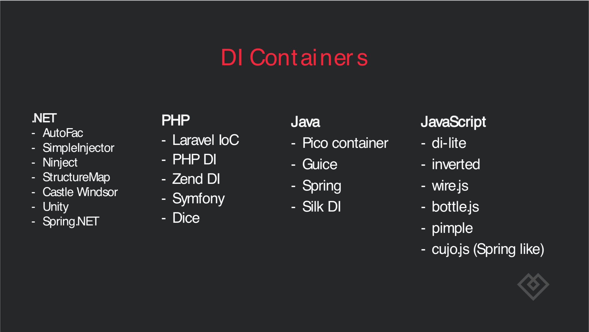
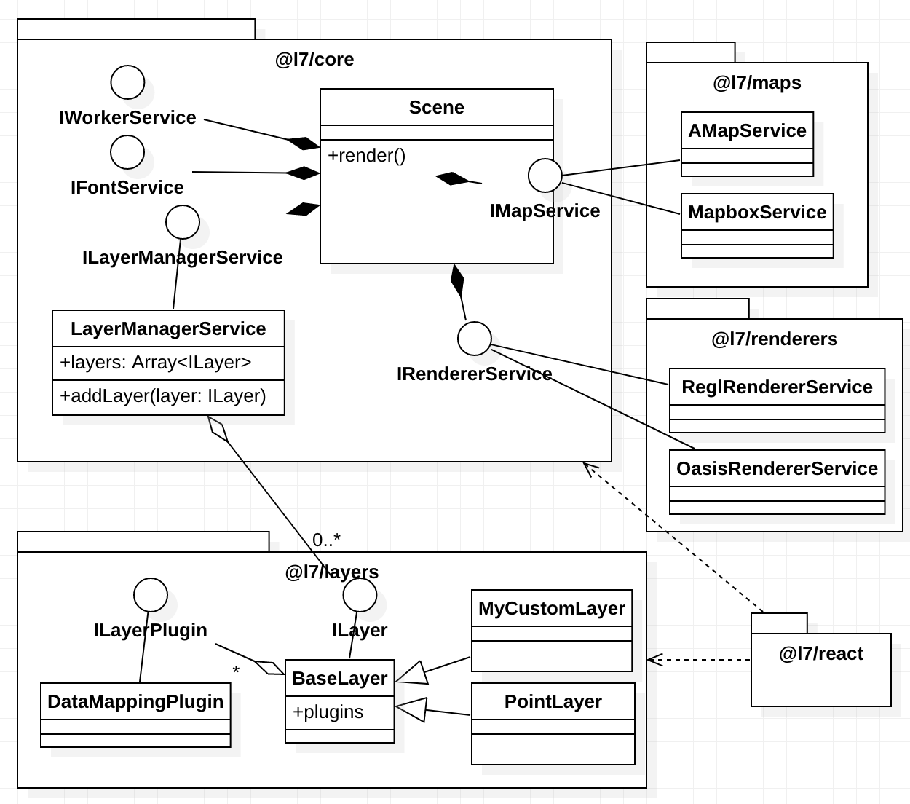
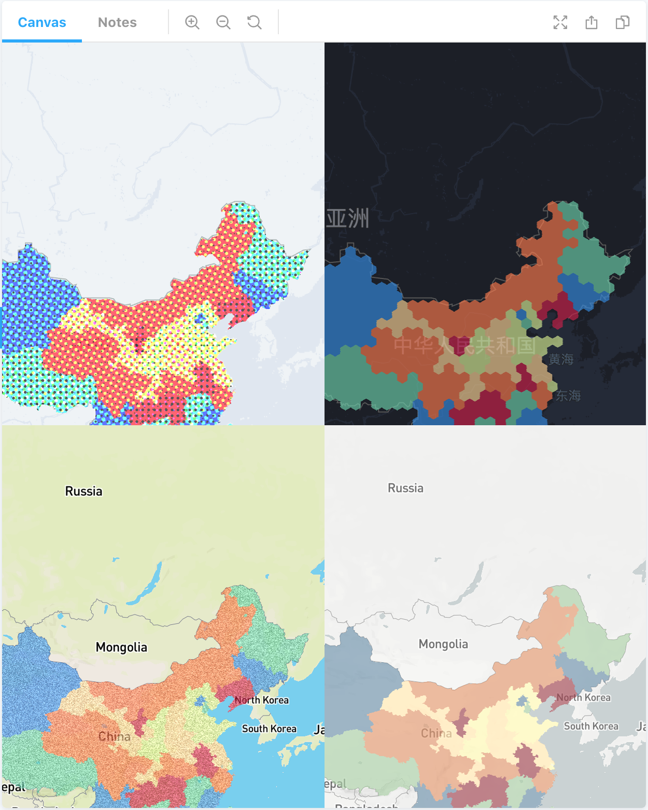

# IoC 容器、依赖注入与服务说明

在面向对象编程领域，[SOLID](https://en.wikipedia.org/wiki/SOLID_(object-oriented_design)) 、[“组合优于继承”](https://en.wikipedia.org/wiki/Composition_over_inheritance) 都是经典的设计原则。

IoC(Inversion of Control) 控制反转这种设计模式将对象的创建销毁、依赖关系交给容器处理，是以上设计原则的一种经典实践。其中它的一种实现 DI(Dependency Injection) 即依赖注入在工程领域应用十分广泛（下图来自 [Dependency-Injection-in-practice-CodeCAMP.pdf](http://www.mono.hr/Pdf/Dependency-Injection-in-practice-CodeCAMP.pdf)），最著名的当属 Spring：



而在 JavaScript 领域，[Angular](https://angular.io/guide/dependency-injection)、[NestJS](https://docs.nestjs.com/fundamentals/custom-providers) 也都实现了自己的 IoC 容器。

L7 选择了 [InversifyJS](https://github.com/inversify/InversifyJS/blob/master/wiki/oo_design.md) 作为轻量的 IoC 容器，统一管理各类复杂的服务，实现松耦合的代码结构，同时具有以下收益：
* 提供高扩展性。
    * 支持地图底图（高德、Mapbox）切换
    * 支持渲染引擎替换
    * 插件化
* 便于测试。测试用例中替换渲染引擎服务为基于 headless-gl 的渲染服务。

下图清晰的展示了切换引擎和底图时均不会影响核心代码：


# 多层次容器

L7 需要支持多场景(Scene)，每个场景中又包含了多个图层(Layer)。不同的服务可能隶属全局、Scene 和 Layer，因此对于容器也有层次化的要求。
试想如果我们只有一个全局容器，其中绑定的所有服务自然也都成了全局服务，在多场景下（页面中一个高德地图、一个 Mapbox）销毁高德地图的渲染服务，将影响到 Mapbox 的展示。

下图为 L7 的四个独立场景（两个高德、两个 Mapbox）DEMO 展示效果，它们应该是能互不干扰运行的：


在 Angular 中也有[分层容器](https://angular.io/guide/hierarchical-dependency-injection)的应用。L7 使用的是 InversifyJS 提供的[层次化依赖注入功能](https://github.com/inversify/InversifyJS/blob/master/wiki/hierarchical_di.md)。

容器层次关系及数目如下：
```bash
RootContainer 1
  -> SceneContainer 1.*
    -> LayerContainer 1.*
``` 
其中每种容器包含不同类型的服务，这些服务有的是单例，有的是工厂方法。子容器应该能访问父容器中绑定的服务，即如果 RootContainer 已经绑定了全局日志服务，SceneContainer 不需要重复绑定也能注入。

下面详细介绍下每种容器中的服务及其 API，在自定义图层、自定义插件以及自定义后处理效果中都可以方便地使用这些服务。

## 全局容器

一些全局性服务不需要用户手动创建，也无需显式销毁。我们在全局容器中完成一次性的绑定，后续在所有场景、图层中都可以让容器注入这些服务的单例。类似 Angular 中的 [root ModuleInjector](https://angular.io/guide/hierarchical-dependency-injection#moduleinjector)。

例如日志、Shader 模块化服务应该是全局性的单例，我们在 `RootContainer` 完成依赖声明：
```typescript
// 在根容器中绑定日志服务为单例
rootContainer
  .bind<ILogService>(TYPES.ILogService)
  .to(LogService)
  .inSingletonScope();
```

目前 L7 中全局性服务说明如下：

| 服务名称 | 类型 | 说明 |
| -------- | --- | --------- |
| logger  | 全局服务 | 在控制台输出信息 |

* 日志服务。
* Shader 模块化服务。提供基本的 GLSL 模块化服务，基于字符串替换实现。
* 配置项校验服务。[详见](./ConfigSchemaValidation.md)

### Shader 模块化服务

通过 `shaderModuleService` 引用，可使用 API 如下：

| 方法名 | 参数 | 返回值 | 说明 |
| -------- | ------------- | --------- | --------- |
| registerModule  | `(moduleName: string, moduleParams: IModuleParams)` | 无 | 使用模块名和参数注册 GLSL 模块，其中 `IModuleParams` 格式见下面  |
| getModule  | `(moduleName: string)` | `IModuleParams` | 根据模块名获取编译后的 GLSL 模块 |

GLSL 模块参数如下：
```typescript
interface IModuleParams {
  vs: string; // vertex shader 字符串
  fs: string; // fragment shader 字符串
  uniforms?: { // 可选，uniforms
    [key: string]: IUniform;
  };
}
```

我们以自定义后处理效果场景为例，完整教程见[自定义后处理效果](自定义后处理效果.md)：
```typescript
protected setupShaders() {
  // 使用 Shader 服务注册 GLSL 模块
  this.shaderModuleService.registerModule('dotScreenEffect', {
    vs: this.quad, // Vertex Shader 固定
    fs: ``, // 暂时省略，在下一小节中详细介绍
  });

  // 使用 Shader 服务获取编译后的 GLSL 模块
  const { vs, fs, uniforms } = this.shaderModuleService.getModule('dotScreenEffect');
  // 使用渲染器服务获取视口尺寸
  const { width, height } = this.rendererService.getViewportSize();

  return {
    vs,
    fs,
    uniforms: {
      ...uniforms,
      u_ViewportSize: [width, height],
    },
  };
}
```

### 配置项校验服务

开发者不需要显式调用该服务。

Layer 子类可以通过重载 `getConfigSchema()` 方法定义自身的特有属性。例如 `PolygonLayer` 需要定义透明度，详见[ConfigSchemaValidation 使用方法](ConfigSchemaValidation.md)：
```typescript
protected getConfigSchema() {
    return {
      properties: {
        opacity: {
          type: 'number',
          minimum: 0,
          maximum: 1,
        },
      },
    };
  }
```

以上就是供开发者使用的常见全局服务，下面我们将介绍场景容器及其内部服务。

## Scene 容器

场景可以承载多个图层，与地图底图一一对应。每个场景都有自己独立的容器确保多个场景间服务不会互相干扰，同时继承全局容器以便访问全局服务。容器内服务包括：

* 地图底图服务。每个场景有一个对应的地图底图。
* 渲染引擎服务。由于依赖 WebGL 上下文，基于 `regl` 实现。
* 图层管理服务。管理场景中所有的图层，负责图层的创建、销毁。
* PostProcessingPass。内置常用的后处理效果。

### 地图底图服务

兼容 Mapbox 和高德，开发者可以获取当前地图的状态、调用地图相机动作（缩放、平移、旋转）。

通过 `mapService` 引用。

常用地图状态获取方法如下：

| 方法名 | 参数 | 返回值 | 说明 |
| -------- | ------------- | --------- | --------- |
| getSize  | 无 | `[number, number]` | 获取地图尺寸（像素单位） |
| getZoom  | 无 | `number` | 获取当前地图缩放等级，以 Mapbox 为准 |
| getCenter | 无 | `{lng: number; lat: number}` | 获取当前地图中心点经纬度 |
| getPitch | 无 | `number` | 获取当前地图仰角 |
| getRotation | 无 | `number` | 获取当前地图逆时针旋转角度 |
| getBounds | 无 | `[[number, number], [number, number]]` | 获取当前地图可视区域 `[西南角、东北角]` |

⚠️对于一些地图属性将采用兼容性处理。

* 缩放等级，差异表现在：
  1. 取值范围。高德缩放等级范围 `[3, 18]`，而 Mapbox 为 `[0, 20]`。
  2. 高德 `3` 缩放等级对应 Mapbox `2` 缩放等级。考虑兼容性，`getZoom()` 将返回 Mapbox 定义等级。
* 旋转角度。高德返回地图顺时针旋转角度，Mapbox 返回逆时针旋转角度。考虑兼容性，`getRotation()` 将返回地图逆时针旋转角度。

除了获取地图状态，还可以控制地图进行一些相机动作。

### [WIP]渲染引擎服务

目前 L7 使用 [regl](https://github.com/regl-project/regl)，但开发者不需要关心底层 WebGL 渲染引擎实现，即使后续更换了其他引擎，我们也将保持服务接口的稳定。

通过 `rendererService` 引用。


### 图层管理服务

开发者不需要显式调用。用于管理场景中所有的图层，负责图层的创建、销毁。

## Layer 容器

每个图层有独立的容器，同时继承自所属场景容器，自然也可以访问全局服务。

* 样式管理服务。
* MultiPassRenderer 服务。详见[MultiPassRenderer 说明](./MultiPassRenderer.md)

## 参考资料

* [动态依赖注入](https://github.com/inversify/InversifyJS/issues/1088)