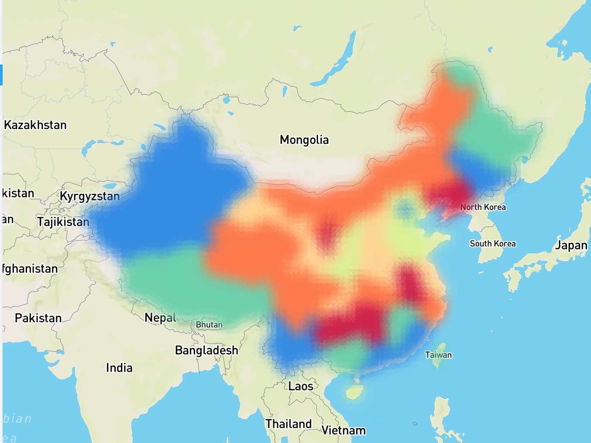

# MultiPassRenderer 实现

每个 Layer 渲染时都需要经历多个流程，从最简单的清屏、拾取到各种各样的后处理。我们希望把复杂渲染流程中每个步骤都抽象出来，让 L7 内部以及用户能够方便的扩展，进行渲染流程的自定义。其中的每一个步骤称作 Pass，负责串联调用各个 Pass 的渲染器称作 MultiPassRenderer。



## 接口设计

目前我们将 Pass 分成两类：
  1. 渲染相关。例如 ClearPass、RenderPass、PickingPass、ShadowPass
  2. 后处理相关。例如 CopyPass、BlurPass

```typescript
export enum PassType {
  Normal = 'normal',
  PostProcessing = 'post-processing',
}
```

每个 Pass 定义两个生命周期节点，初始化和渲染，并将当前 Layer 作为参数传入。因此 Pass 中可以访问 Layer 上的属性及方法：
```typescript
export interface IPass {
  getType(): PassType;
  init(layer: ILayer): void;
  render(layer: ILayer): void;
}
```

其中后处理相关的 Pass 比较特殊，例如最后一个 PostProcessingPass 需要自动切换 renderTarget 为屏幕：
```typescript
export interface IPostProcessingPass extends IPass {
  setRenderToScreen(renderToScreen: boolean): void;
  isEnabled(): boolean;
  setEnabled(enabled: boolean): void;
}
```

具体实现依赖 `@l7/renderer` 实现，目前使用 regl 实现 IFramebuffer 等接口。

## 内置 Pass

目前我们仅对外开放 PostProcessing 后处理相关 Pass 的配置。在 L7 内部我们使用如下流程：
```
ClearPass -> RenderPass -> [ ...其他后处理 Pass ] -> CopyPass
```

目前各内置 Pass 说明如下：
| Pass 名称 | 类型 | 参数 | 说明 |
| -------- | --- | ------------- | --------- |
| ClearPass  | normal | 无 | 清除 framebuffer，clearColor 为 [0, 0, 0, 0] |
| RenderPass | normal | 无 | 渲染到 framebuffer，作为后续后处理的输入 |
| CopyPass   | post-processing | 无 | 作为后处理最后一个 Pass，负责拷贝 framebuffer 到屏幕输出 |
| BlurHPass  | post-processing | `blurRadius` 水平方向模糊半径，默认值为 `8.0` | [高斯模糊 blur9](https://github.com/Jam3/glsl-fast-gaussian-blur/blob/master/9.glsl) |
| BlurVPass  | post-processing | `blurRadius` 垂直方向模糊半径，默认值为 `8.0` | 同上 |

后续待实现 Pass 如下：
* [] PickingPass 负责拾取
* [] ShadowPass 负责生成 shadowMap，供 PCF、CSM 等实时阴影技术使用

## 使用方法

在每个 Layer 中，通过 `enableMultiPassRenderer` 开启之后，可以配置各个 Pass 的参数。配置方法类似 babel 插件：
```typescript
const layer = new PolygonLayer({
  enableMultiPassRenderer: true,
  passes: [
    'blurH', // 使用 BlurHPass
    [
      'blurV', // 使用 BlurVPass
      {
        blurRadius: 20, // 设置模糊半径
      },
    ],
  ],
});
```