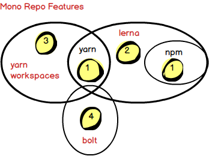

# 构建方案

考虑到 L7 提供的三种[使用方法](./使用方法.md)：CDN、Submodule 和 React 组件，我们需要提供对应的构建方案。

由于 React 组件待开发，下面我们将从方案技术细节、优化手段两方面介绍 CDN 和 Submodule 的构建方案。

## CDN

考虑到后续将引入 WebWorker 特性，目前 Webpack4 暂时还不支持多种 target（web + webworker）混合的输出模式，相关 [ISSUE](https://github.com/webpack/webpack/issues/6525)。
如果后续支持，配合 SplitChunksPlugin 应该能解决在 Worker 和不同 entry 之间共享代码的问题。

因此目前和 Mapbox 做法一样，我们使用 Rollup 构建 CDN Bundler。

打包命令如下，会在 `packages/l7/dist` 下输出产物：
```bash
yarn bundle
```

### UMD

以 L7 为命名空间，让用户可以通过类似 `L7.Scene` 的方式使用。同时以 UMD 为构建目标，输出到 `packages/l7/dist` 下：
```javascript
{
  input: resolveFile('build/bundle.ts'),
  output: {
    file: resolveFile('packages/l7/dist/bundle.js'),
    format: 'umd',
    name: 'L7',
  },
}
```

目前只需要暴露场景以及图层相关的 API，因此 Bundler 非常简单：
```typescript
// build/bundle.ts
export * from '@antv/l7';
```

### Alias

为了帮助 resolver 定位 lerna packages，需要重命名类似 `@antv/l7-scene` 这样的依赖路径：
```javascript
import alias from '@rollup/plugin-alias';

plugins: [
  alias(
    {
      resolve: ['.tsx', '.ts'],
      entries: [
        {
          find: /^@l7\/(.*)/,
          replacement: resolveFile('packages/$1/src'),
        },
      ]
    },
  ),
]
```

配合 [`terser`](https://github.com/TrySound/rollup-plugin-terser) 压缩后，我们就能得到可运行的 CDN 版本了，但从减少构建产物大小出发还有很多优化可以做。

### 减少包大小

除了 Rollup 提供的 TreeShaking，我们主要从三个方面考虑：
* 减少第三方依赖大小尤其是 Lodash
* external Mapbox 依赖
* 压缩 GLSL 代码
  * 去除多余空格、换行符和注释
  * 内联 WebGL 常量
  * 预计算 define 变量

#### Lodash 按需引用

通过 analysis 插件可以看到第三方依赖大小占比：
```
/node_modules/lodash/lodash.js
███████████░░░░░░░░░░░░░░░░░░░░░░░░░░░░░░░░░░░░░░░ 23.79 % (540.328 KB)
/node_modules/regl/dist/regl.js
██████░░░░░░░░░░░░░░░░░░░░░░░░░░░░░░░░░░░░░░░░░░░░ 12.21 % (277.403 KB)
/node_modules/hammerjs/hammer.js
█░░░░░░░░░░░░░░░░░░░░░░░░░░░░░░░░░░░░░░░░░░░░░░░░░ 3.25 % (73.847 KB)
/node_modules/uri-js/dist/es5/uri.all.js
█░░░░░░░░░░░░░░░░░░░░░░░░░░░░░░░░░░░░░░░░░░░░░░░░░ 2.28 % (51.721 KB)
```

仔细查看 Lodash 的引用情况：
```
███████████░░░░░░░░░░░░░░░░░░░░░░░░░░░░░░░░░░░░░░░
file:            /node_modules/lodash/lodash.js
bundle space:    23.79 %
rendered size:   540.328 KB
original size:   540.51 KB
code reduction:  0.03 %
dependents:      13
  - /packages/core/src/services/layer/StyleAttribute.ts
  - /packages/core/src/services/shader/ShaderModuleService.ts
  - /packages/core/src/services/renderer/passes/post-processing/BlurHPass.ts
```

按需引用 Lodash 常见的做法有几种：
* [loash-es](https://github.com/lodash/lodash/tree/es)
* babel-plugin-lodash
* lodash-webpack-plugin

由于我们使用 Rollup 以及 `rollup-plugin-babel`，[babel-plugin-lodash](https://github.com/lodash/babel-plugin-lodash) 可以很好地解决这个问题。该插件的[原理](https://github.com/rollup/rollup/issues/610#issuecomment-270801483)其实也是引用 `lodash-es`：
```javascript
// this...
import { template } from 'lodash-es';

// ...basically becomes this:
import template from 'lodash-es/template.js';
```

最终的效果还是很明显的：
```
/node_modules/regl/dist/regl.js
████████░░░░░░░░░░░░░░░░░░░░░░░░░░░░░░░░░░░░░░░░░░ 16.55 % (277.403 KB)
/node_modules/hammerjs/hammer.js
██░░░░░░░░░░░░░░░░░░░░░░░░░░░░░░░░░░░░░░░░░░░░░░░░ 4.41 % (73.847 KB)
/node_modules/uri-js/dist/es5/uri.all.js
█░░░░░░░░░░░░░░░░░░░░░░░░░░░░░░░░░░░░░░░░░░░░░░░░░ 3.09 % (51.721 KB)
/node_modules/lodash.mergewith/index.js
█░░░░░░░░░░░░░░░░░░░░░░░░░░░░░░░░░░░░░░░░░░░░░░░░░ 3.06 % (51.256 KB)
```

#### 剔除 Mapbox

不同于高德异步加载的方式，Mapbox 用户需要手动引入 Mapbox 的 JS 和 CSS，因此 L7 CDN 版本就需要剔除了。通过 `globals` 假定用户负责引入 Mapbox 的 CDN 版本：
```javascript
{
  output: {
    globals: {
      'mapbox-gl': 'mapboxgl',
    },
  },
  external: [
    'mapbox-gl',
  ],
}
```

这样 L7 Bundler 中就不包含 Mapbox 的 Module Bundler(mapbox-gl) 了。

#### 内联 WebGL 常量

在构建阶段可以将 WebGL 常量替换成对应的值，可以减少字符长度：
```javascript
// from
const max = gl.MAX_VERTEX_ATTRIBS;
// to
const max = 34921;
```

luma.gl 和 deck.gl 都使用了 [babel-plugin-inline-webgl-constants](https://www.npmjs.com/package/babel-plugin-inline-webgl-constants)。

来看一下实际效果，在压缩前就能减少字符长度：
```javascript
// 内联前
const usageMap = {
  [gl.STATIC_DRAW]: 'static',
  [gl.DYNAMIC_DRAW]: 'dynamic',
  [gl.STREAM_DRAW]: 'stream'
};
// 内联后
const usageMap = {
  [35044]: 'static',
  [35048]: 'dynamic',
  [35040]: 'stream'
};
```

#### 压缩 GLSL 代码

在开发编写 Shader 时，我们是不需要对 GLSL 代码进行压缩的，因为在 Shader 编译失败时能根据错误信息定位到具体行列。

但是在生产环境下，我们就需要把 GLSL 源代码中包含的**多余**的换行、空格以及注释去掉，减少最终引入字符串的大小。

这里需要注意的是并不是所有换行都可以简单去除，例如 `define` 语句末尾的换行一定要保留。

luma.gl 和 deck.gl 使用了 [babel-plugin-remove-glsl-comments](https://github.com/uber/luma.gl/tree/master/dev-modules/babel-plugin-remove-glsl-comments) 简单地移除注释，但很明显，多余的空格和换行符依然存在。

因此我们需要写一个简单的 Rollup 插件：
```javascript
export default function glsl(include, minify) {
  const filter = createFilter(include);
  return {
    name: 'glsl',
    transform(code, id) {
      if (!filter(id)) return;

      if (minify) {
        code = code
          .trim() // strip whitespace at the start/end
          .replace(/\n+/g, '\n') // collapse multi line breaks
          // remove comments
          .replace(INLINE_COMMENT_REGEX, '\n')
          .replace(BLOCK_COMMENT_REGEX, '')
          .replace(/\n\s+/g, '\n') // strip identation
      }

      return {
        code: `export default ${JSON.stringify(code)};`,
        map: { mappings: '' }
      };
    }
  };
}
```

#### GLSL minifier

以上针对 GLSL 的压缩仅限于字符替换，更彻底的优化必然需要生成 GLSL 对应的 AST，从而进行变量重命名、死代码消除等等更高级的优化手段。[glsl-minifier](https://github.com/TimvanScherpenzeel/glsl-minifier) 就是这样一个 CLI 工具。

其中的预计算特性有点类似 [Prepack](https://github.com/facebook/prepack)，在构建阶段就计算出 `define` 变量的值：
```glsl
#define SPREAD 8.00
#define MAX_DIR_LIGHTS 0
#define MAX_POINT_LIGHTS 0
#define MAX_SPOT_LIGHTS 0
#define MAX_HEMI_LIGHTS 0
#define MAX_SHADOWS 0
#define GAMMA_FACTOR 2

uniform mat4 viewMatrix;
uniform vec3 cameraPosition;

uniform vec2 resolution;
uniform float time;
uniform sampler2D texture;

void main() {
  vec2 uv = gl_FragCoord.xy / resolution.xy;

  float v = texture2D( texture, uv ).x;

  if (v == 1000.) discard;
  v = sqrt(v);

  gl_FragColor = vec4( vec3( 1. - v / SPREAD ), 1.0 );
}
```

上述代码压缩结果如下，`define` 统统不见了，变量名也进行了改写：
```glsl
uniform highp vec2 resolution;uniform sampler2D texture;void main(){highp vec2 a;a=(gl_FragCoord.xy/resolution);lowp vec4 b;b=texture2D(texture,a);if((b.x==1000.0)){discard;}lowp vec4 c;c.w=1.0;c.xyz=vec3((1.0-(sqrt(b.x)/8.0)));gl_FragColor=c;}
```

当然 glsl-minifier 做的远不止这些，还会应用变量名改写、死代码消除等等优化手段：
> Optimisations include function inlining, dead code removal, copy propagation, constant folding, constant propagation, arithmetic optimizations and so on. Minifications includes variable rewriting and whitespace trimming.

显然这种手段要求我们的 Shader 代码在构建时是稳定的，然而 L7 使用的 GLSL 模块化方案需要在运行时进行模块拼接，如果在构建时代码片段中包含的变量发生了改写，势必影响运行时的拼接结果。另外 minifier 会校验代码的正确性，不理解我们自定义的模块引入语句 `pragma include 'module'` 是一定会报错的。

以这样的 Shader 为例：
```glsl
#pragma include "project"

void main() {
  // 从 project 模块引入方法
  project(position);
}
```

执行压缩时会报错：
```bash
$ node_modules/.bin/glsl-minifier -i ./build/example.frag -o ./build/example.min.frag
Error:
(28,2): error: no function with name 'project'

Exiting glsl-minifier!
```

因此要想使用这个终极压缩方案，需要修改 L7 目前的 GLSL 模块化方案，代码拼接不能在运行时而需要在构建时完成。但这样就很难兼顾扩展性，毕竟用户自定义图层的 Shader 代码肯定只有运行时才能拿到。

所以一个折中的办法是在构建时先对 L7 内置图层的 Shader 代码进行模块化处理，得到最终的 GLSL 文本，然后再 minify。同时保留运行时模块化拼接的能力，应对用户自定义图层。

## Submodule

npm 和 yarn 只提供了例如 `npm link` 以及 `yarn link` 这样的功能，而 yarn workspaces 只提供了 monorep 需要的底层 link 功能。相比之下 lerna 提供了更高级的功能例如 publish 和 version。因此 yarn workspaces 和 lerna 完全可以组合使用，这也是例如 Jest 等大型项目的使用方式。



构建命令如下，会在各个 package 下生成 `/lib` 和 `/es` 两个文件夹分别包含 ES2015 和 ESModule 产物：
```bash
yarn build
```

### 编译 TS

使用 TS 有两种构建方式：
* native TypeScript with tsc
* [@babel/preset-typescript](https://babeljs.io/docs/en/babel-preset-typescript)

由于我们的项目中需要使用到一些 babel plugin（装饰器、引入 GLSL 等），因此后者显然是更好的选择。这里我们使用 babel 7 的项目全局配置 configFile。

为了合并 ES2015 与 ESModule，我们参考 [redux](https://babeljs.io/blog/2018/06/26/on-consuming-and-publishing-es2015+-packages#conflating-javascript-modules-and-es2015)：
```json
// redux package.json
{
  "main": "lib/redux.js", // ES5 + Common JS
  "module": "es/redux.js", // ES5 + JS Modules
}
```

开发模式加上 `--watch` 即可。
* `--root-mode upward`  使用 root 下的 babel 配置文件
* `--out-dir dist` 输出到 /dist  文件夹下
* `--delete-dir-on-start` 每次构建前清空，因此不需要 `rimraf`
```json
"scripts": {
   "build": "father build",
  "build:cjs": "BABEL_ENV=cjs babel src --root-mode upward --out-dir lib --source-maps --extensions .ts,.tsx --delete-dir-on-start --no-comments",
  "build:esm": "BABEL_ENV=esm babel src --root-mode upward --out-dir es --source-maps --extensions .ts,.tsx --delete-dir-on-start --no-comments"
},
```

### 生成 TS 声明文件

和构建前类型检查不同，此时我们需要 tsc 输出类型声明文件了：
```json
{
  "postbuild": "yarn build:declarations",
  "build:declarations": "lerna exec --stream --no-bail 'tsc --project ./tsconfig.build.json'"
}
```

当然不需要包含 story 和测试用例：
```json
{
  "extends": "./tsconfig.json",
  "compilerOptions": {
    "noEmit": false,
    "emitDeclarationOnly": true,
    "declaration": true,
    "rootDir": "./",
    "baseUrl": "./",
    "paths": {
      "@antv/l7-*": ["packages/*/src"],
      "@antv/l7": ["packages/l7/src"],
      "*": ["node_modules", "packages"]
    }
  },
  "exclude": ["**/*.story.*", "**/__tests__/**/*", "**/*.spec.*", "dist"],
  "include": []
}
```

### 按需引入地图依赖

以 L7 Bundler 方式使用时，由于需要在运行时根据用户配置项选择地图底图，会导致构建时需要将全部地图依赖引入，无法进行 TreeShaking。
目前高德地图使用运行时异步加载方式引入，不会导致该问题，但 Mapbox 同样使用 Bundler，对于高德用户就多余了。

[ISSUE](https://github.com/antvis/L7/issues/86)
