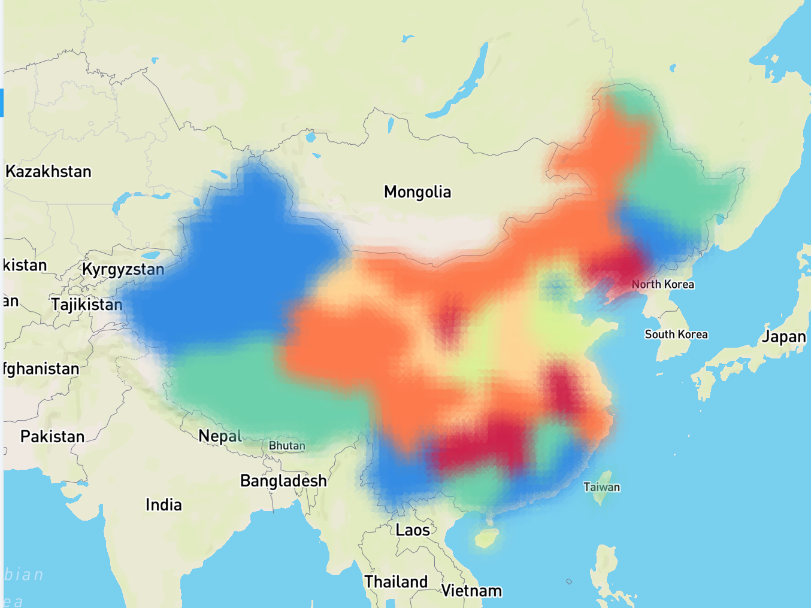
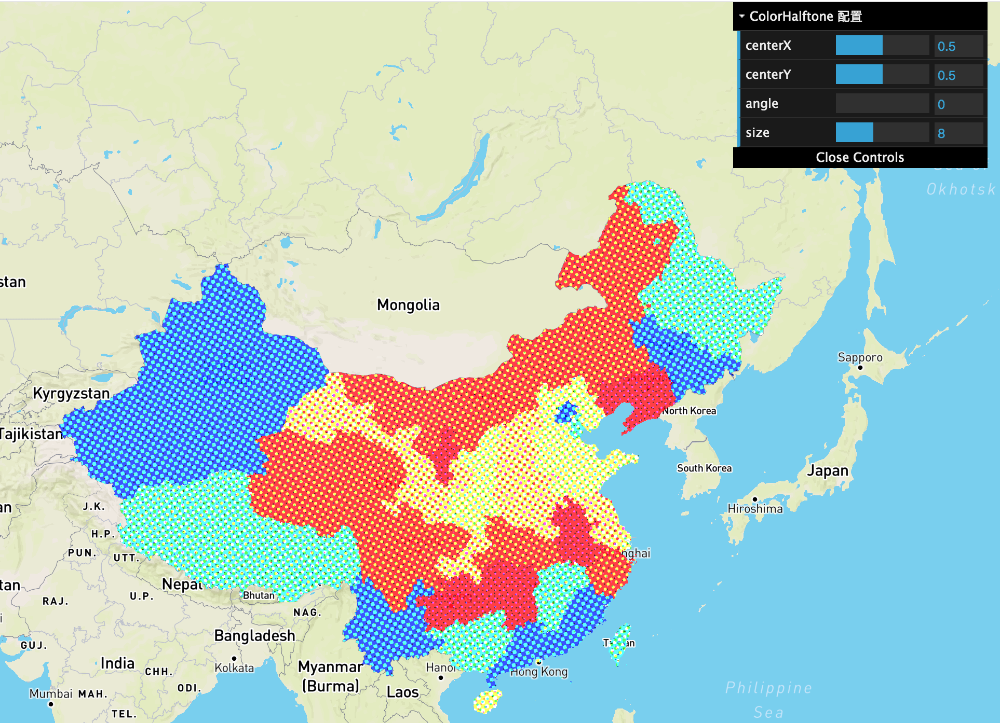
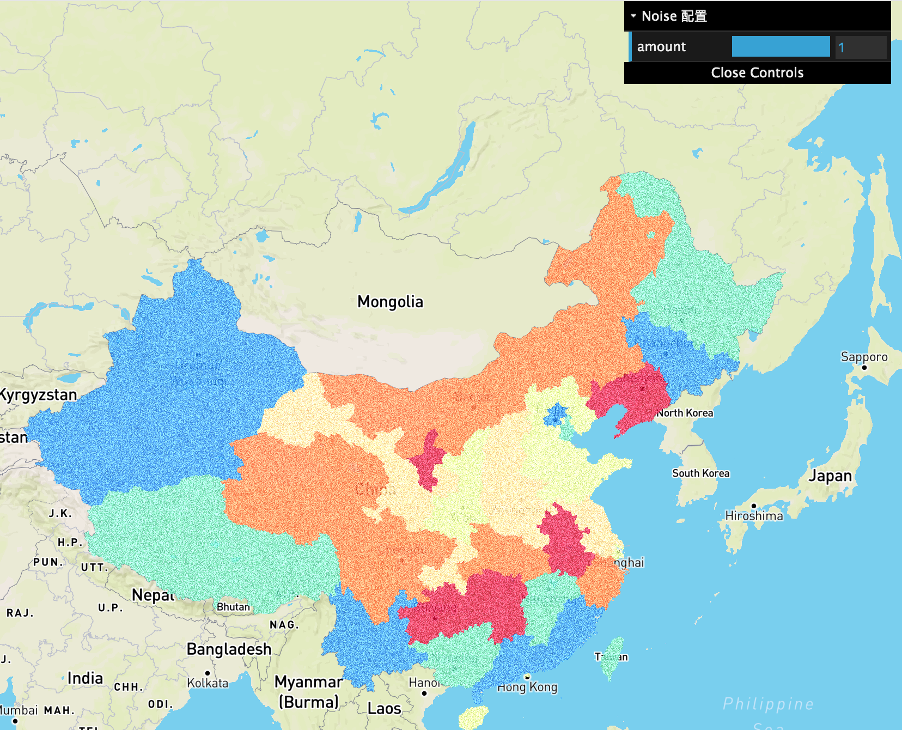
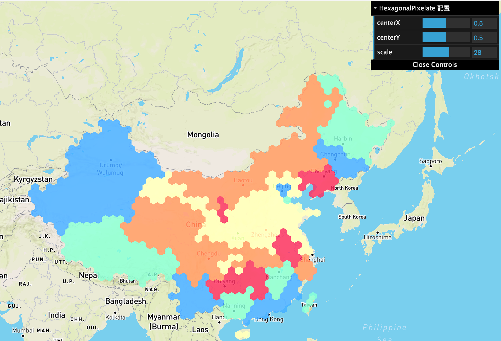
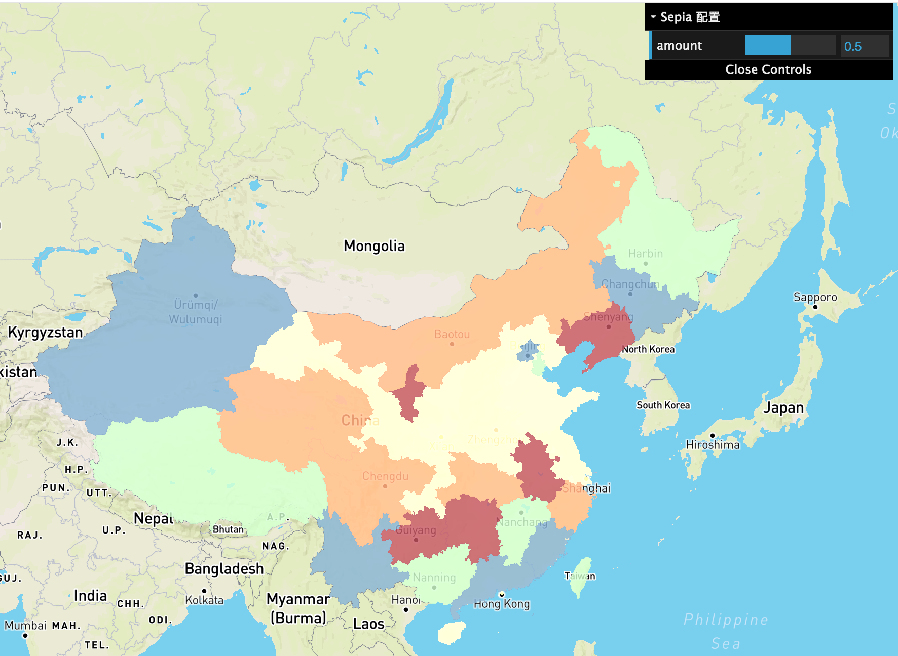

# MultiPassRenderer 实现

每个 Layer 渲染时都需要经历多个流程，从最简单的清屏、拾取到各种各样的后处理。我们希望把复杂渲染流程中每个步骤都抽象出来，让 L7 内部以及用户能够方便的扩展，进行渲染流程的自定义。其中的每一个步骤称作 Pass，负责串联调用各个 Pass 的渲染器称作 MultiPassRenderer。



## 接口设计

目前我们将 Pass 分成两类：

1. 渲染相关。例如 ClearPass、RenderPass、PickingPass、ShadowPass
2. 后处理相关。例如 CopyPass、BlurPass

```typescript
export enum PassType {
  Normal = 'normal',
  PostProcessing = 'post-processing',
}
```

每个 Pass 定义两个生命周期节点，初始化和渲染，并将当前 Layer 作为参数传入。因此 Pass 中可以访问 Layer 上的属性及方法：

```typescript
export interface IPass {
  getType(): PassType;
  init(layer: ILayer): void;
  render(layer: ILayer): void;
}
```

其中后处理相关的 Pass 比较特殊，例如最后一个 PostProcessingPass 需要自动切换 renderTarget 为屏幕：

```typescript
export interface IPostProcessingPass extends IPass {
  setRenderToScreen(renderToScreen: boolean): void;
  isEnabled(): boolean;
  setEnabled(enabled: boolean): void;
}
```

具体实现依赖 `@antv/l7-renderer` 实现，目前使用 regl 实现 IFramebuffer 等接口。

## 内置 Pass

目前我们仅对外开放 PostProcessing 后处理相关 Pass 的配置。在 L7 内部我们使用如下流程：

```
ClearPass -> RenderPass -> [ ...其他后处理 Pass ] -> CopyPass
```

目前各内置 Pass 说明如下：

| Pass 名称   | 类型            | 参数 | 说明                                                     |
| ----------- | --------------- | ---- | -------------------------------------------------------- |
| ClearPass   | normal          | 无   | 清除 framebuffer，clearColor 为 [0, 0, 0, 0]             |
| RenderPass  | normal          | 无   | 渲染到 framebuffer，作为后续后处理的输入                 |
| PickingPass | normal          | 无   | 负责拾取，[详见](./PixelPickingEngine.md)                |
| TAAPass     | normal          | 无   | [详见](./TAA.md)                                         |
| CopyPass    | post-processing | 无   | 作为后处理最后一个 Pass，负责拷贝 framebuffer 到屏幕输出 |

剩余后处理效果见最后一节。
后续待实现 Pass 如下：

- [ ] ShadowPass 负责生成 shadowMap，供 PCF、CSM 等实时阴影技术使用

## 使用方法

在每个 Layer 中，通过 `enableMultiPassRenderer` 开启之后，可以配置各个 Pass 的参数。配置方法类似 babel 插件：

```typescript
const layer = new PolygonLayer({
  enableMultiPassRenderer: true,
  passes: [
    'blurH', // 使用 BlurHPass
    [
      'blurV', // 使用 BlurVPass
      {
        blurRadius: 20, // 设置模糊半径
      },
    ],
  ],
});
```

## 内置后处理效果

参考了 [glfx](https://github.com/evanw/glfx.js) 中的一些常用图像处理效果。可以按照名称引用，顺序决定了各个效果的应用次序。例如我们想依次应用噪声和模糊效果：

```typescript
const layer = new PolygonLayer({
  passes: [
    [
      'noise', // 使用 NoisePass
      {
        amount: 0.5,
      },
    ]
    'blurH', // 使用 BlurHPass
    'blurV', // 使用 BlurVPass
  ],
});
```

下面详细介绍各个后处理效果及其参数，在 DEMO 中也可以通过 GUI 任意调节参数。

### 高斯模糊

采用 [高斯模糊 blur9](https://github.com/Jam3/glsl-fast-gaussian-blur/blob/master/9.glsl)。

名称：`blurH/blurV`

参数：

- `blurRadius` 水平/垂直方向模糊半径，默认值为 `8.0`

效果如下：


### ColorHalftone

CMYK halftone 效果

名称：`colorHalftone`

参数：

- `angle` pattern 旋转角度，默认值为 0
- `size` pattern 大小，默认值为 8
- `center` `[x, y]` pattern 的中心，默认值为 `[0, 0]`

效果如下：



### 噪声

噪声效果。

名称：`noise`

参数：

- `amount` 噪声程度，范围 `[0, 1]`，默认值为 `0.5`

效果如下：



### 六边形像素化处理

六边形像素化处理。

名称：`hexagonalPixelate`

参数：

- `scale` 六边形大小，默认值为 `10`
- `center` `[x, y]` pattern 的中心，默认值为 `[0.5, 0.5]`

效果如下：



### Sepia

Sepia 颜色映射。

名称：`sepia`

参数：

- `amount` 程度，范围 `[0, 1]`，默认值为 `0.5`

效果如下：


