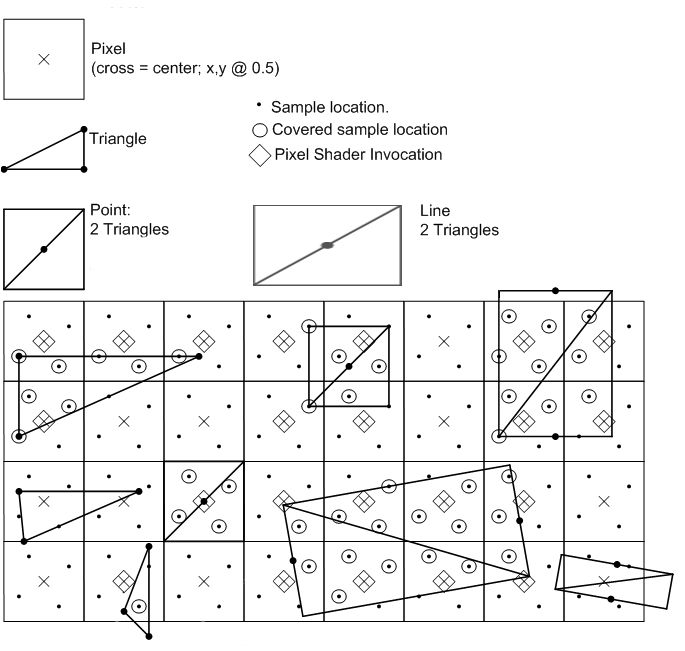
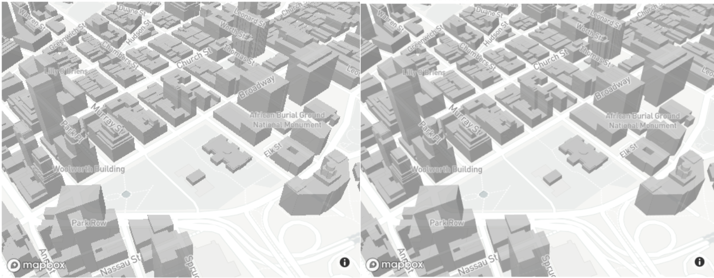
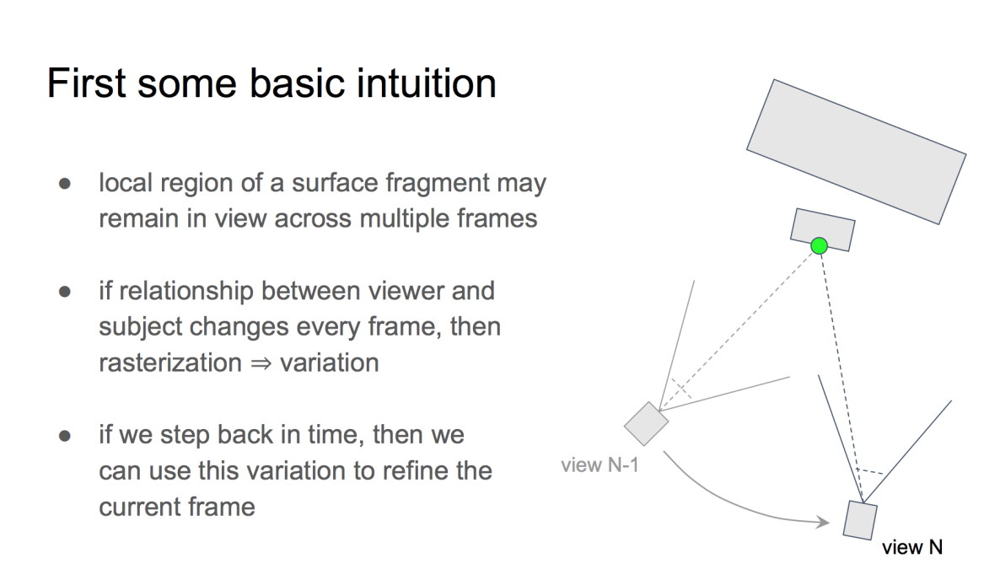
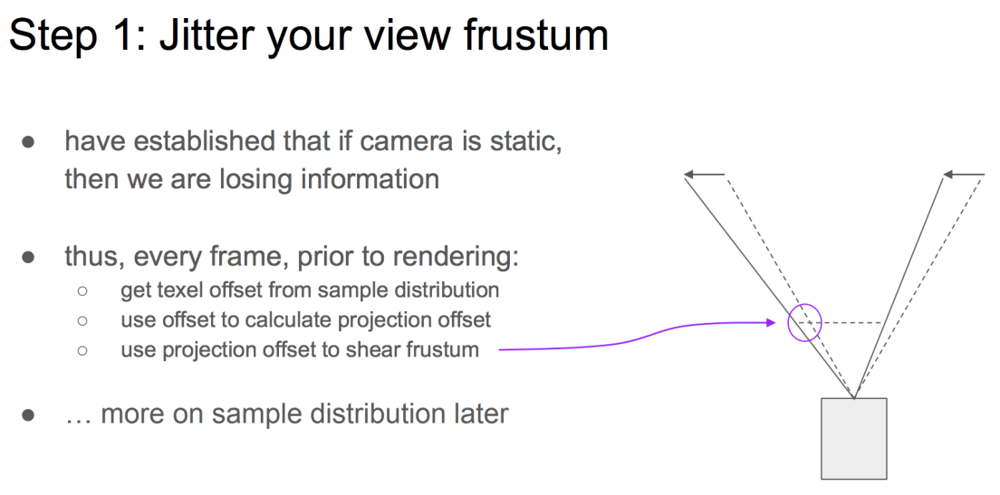
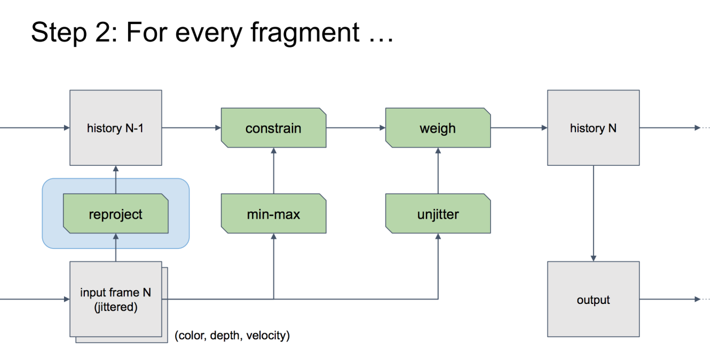
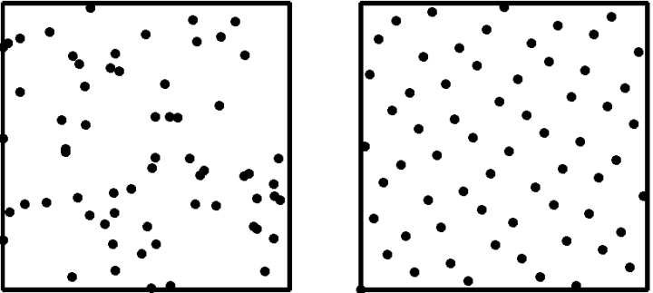
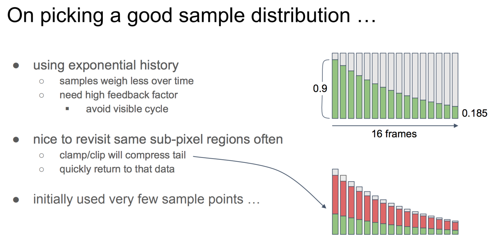
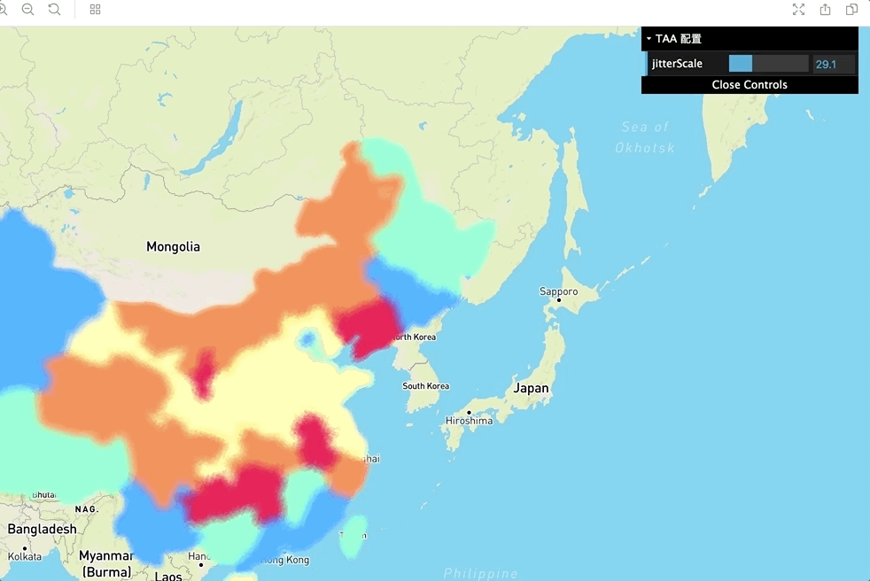

# 在地理场景中应用 TAA

## 问题背景

关于走样产生的原因以及常用的反走样手段，可以参考「知乎 - 反走样技术（一）：几何反走样」[🔗](https://zhuanlan.zhihu.com/p/28800047)。
我之前也简单总结了下 SSAA、MLAA/SMAA、FXAA 等反走样技术的实现细节。

其中 MSAA 作为浏览器内置实现，开发者使用起来很简单：

> 相对于着色走样，人眼对几何走样更敏感。MSAA 的原理很简单，它仍然把一个像素划分为若干个子采样点，但是相较于 SSAA，每个子采样点的颜色值完全依赖于对应像素的颜色值进行简单的复制（该子采样点位于当前像素光栅化结果的覆盖范围内），不进行单独计算。此外它的做法和 SSAA 相同。由于 MSAA 拥有硬件支持，相对开销比较小，又能很好地解决几何走样问题，在游戏中应用非常广泛（我们在游戏画质选项中常看到的 4x/8x/16x 抗锯齿一般说的就是 MSAA 的子采样点数量分别为4/8/16个）。

下图为 4x MSAA 采样点示意：



在 Mapbox 中左图未开启 MSAA 而右图选择开启，观察立方体边缘可以发现明显的几何走样：相关 [ISSUE](https://github.com/mapbox/mapbox-gl-js/pull/8474)。


但是 MSAA 存在一些限制：

- WebGL1 不支持对 FBO 进行，因此开启 post-processing 后处理时 MSAA 就失效了。当然 WebGL2 支持 🔗。
- 即使开启，浏览器在某些情况下也不保证应用 🔗。

因此在需要后处理的场景中（例如 L7 的热力图需要 blur pass、PBR 中的 SSAO 环境光遮蔽），只能采用其他反走样手段。

## TAA(Temporal Anti-Aliasing) 原理

来自「知乎 - Experimentalize TAA with no code」🔗：

> 严格来说 TAA 并不能算一个具体的算法，而是更像一个统一的算法框架。和 SSAA 一样，TAA 也能够同时减轻几何走样和着色走样的问题。

关于 TAA 的原理，「GDC - Temporal Reprojection
Anti-Aliasing in INSIDE」[🔗](http://twvideo01.ubm-us.net/o1/vault/gdc2016/Presentations/Pedersen_LasseJonFuglsang_TemporalReprojectionAntiAliasing.pdf) 讲的十分清晰。如果相机和物体的相对位置在当前帧之前发生过变化，那么当前帧就可以以若干前序帧进行修正。



但如果在前序帧中相机和物体都没有发生过变化，那对于当前帧就无从修正了。因此可以对视锥进行抖动，在渲染每一帧之前，使用抖动矩阵对投影矩阵进行偏移，最终实现视锥的偏移：



然后在 FS 中，最关键的就是 reproject 这一步：



对于静止场景，「Three.js - TAA example」[🔗](https://threejs.org/examples/#webgl_postprocessing_taa)、「ECharts.GL - temporalSuperSampling」[🔗](https://echarts.apache.org/zh/option-gl.html#globe.temporalSuperSampling) 都采用了这种方法。

## 实现方法

由于需要对投影矩阵进行抖动，我们需要选取低差异序列。
来自「知乎 - 低差异序列（一）- 常见序列的定义及性质」🔗，右图明显比左图纯随机生成覆盖面广：



参考 ECharts.GL，我们选择 `Halton(2,3)` 低差异序列：

```typescript
const offset = this.haltonSequence[this.frame % this.haltonSequence.length];
this.cameraService.jitterProjectionMatrix(
  ((offset[0] * 2.0 - 1.0) / width) * jitterScale,
  ((offset[1] * 2.0 - 1.0) / height) * jitterScale,
);
```

在每一帧都会尝试进行累加。如果在连续运动过程中，TAA 的累加过程必然来不及完成，此时只需要输出当前帧原始结果即可，随后尝试继续轮询累加是否完成。因此在累加完成之前，都会输出当前帧未经 TAA 的结果。

最后我们需要进行加权平均，历史帧的权重应当越来越小：



这里我们选择当前帧权重为 0.9，历史帧为 0.1：

```typescript
useFramebuffer(this.outputRenderTarget, () => {
  this.blendModel.draw({
    uniforms: {
      u_opacity: layerStyleOptions.opacity || 1,
      u_MixRatio: this.frame === 0 ? 1 : 0.9,
      u_Diffuse1: this.sampleRenderTarget,
      u_Diffuse2: this.frame === 0 ? layer.multiPassRenderer.getPostProcessor().getReadFBO() : this.prevRenderTarget,
    },
  });
});
```

最后我们将最终的混合结果“拷贝”给后处理模块，实现渐进增强的效果：

```typescript
useFramebuffer(layer.multiPassRenderer.getPostProcessor().getReadFBO(), () => {
  this.copyModel.draw({
    uniforms: {
      u_Texture: this.copyRenderTarget,
    },
  });
});
// 调用后处理模块应用后续效果
layer.multiPassRenderer.getPostProcessor().render(layer);
```

## 最终效果

为了更直观地看到效果，在 DEMO 中我们可以调节相机抖动范围：



## 参考资料

- 「知乎 - 反走样技术（一）：几何反走样」[🔗](https://zhuanlan.zhihu.com/p/28800047)
- 「知乎 - Experimentalize TAA with no code」[🔗](https://zhuanlan.zhihu.com/p/41642855)
- 「ECharts.GL - temporalSuperSampling」[🔗](https://echarts.apache.org/zh/option-gl.html#globe.temporalSuperSampling)
- 「Mapbox - set custom layers and extrusion examples to use antialias: true」[🔗](https://github.com/mapbox/mapbox-gl-js/pull/8474)
- 「Three.js - TAA example」[🔗](https://threejs.org/examples/#webgl_postprocessing_taa)
- 「Paper - Amortized Supersampling」[🔗](http://hhoppe.com/supersample.pdf)
- 「GDC - Temporal Reprojection Anti-Aliasing in INSIDE」[🔗](http://twvideo01.ubm-us.net/o1/vault/gdc2016/Presentations/Pedersen_LasseJonFuglsang_TemporalReprojectionAntiAliasing.pdf)
- 「知乎 - 低差异序列（一）- 常见序列的定义及性质」[🔗](https://zhuanlan.zhihu.com/p/20197323)
