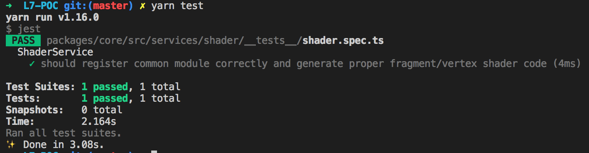

# 自动化测试方案

如何测试一个 WebGL 应用渲染结果是否正确呢？常用的做法是进行像素比对，当然这也只能用于一些简单的判断例如渲染是否成功，整体的 Snapshot 比对开销很大。

但不管怎么说，这都意味着我们必须使用 WebGL API 进行真实的渲染。

以上过程在测试用例中描述如下：

```javascript
// 1. 绘制
// 2. 读取像素
const pixels = new Uint8Array(width * height * 4);
gl.readPixels(0, 0, width, height, gl.RGBA, gl.UNSIGNED_BYTE, pixels);
// 3. 判断某个像素点是否符合预期
```

在与测试框架结合时，常用的方案有：

- Electron 除了 WebGL API，DOM API 等其他浏览器实现对于 WebGL 测试都是多余的，在 CI 时需要安装的依赖过大，所需的启动时间也很长。
- [node-webgl](https://github.com/mikeseven/node-webgl) 不同于 WebGL，可以直接调用 OpenGL 驱动，但同样包含了很多 WebGL 之外的特性。

这里我们选择 [headless-gl](https://github.com/stackgl/headless-gl)，一个纯粹的 WebGL 1 规范的实现。并且能够很容易集成进现有的 [CI 流程](https://github.com/stackgl/headless-gl#how-can-i-use-headless-gl-with-a-continuous-integration-service)中，例如 [TravisCI](https://travis-ci.org/) 和 [AppVeyor](http://www.appveyor.com/)。

## 测试框架

在配置测试框架前，我们必须解决一个 WebGL 项目中常见的问题。

### 引入 GLSL 文件

如何在测试时正确引入 GLSL 文件是一个问题。目前各个 3D 引擎常用的做法有两种：

- 以字符串形式直接写在 `.js` 文件中。`luma.gl/deck.gl` 使用[这种方式](https://github.com/uber/deck.gl/blob/7.1-release/modules/layers/src/arc-layer/arc-layer-fragment.glsl.js)。
- 使用 `.glsl` 编写，测试前使用构建脚本自动生成对应的 `.js` 文件。`Three.js`、`clay.gl` 使用[这种方式](https://github.com/pissang/claygl/blob/master/build/glsl2js.js)。

前者的好处是测试流程无需做过多修改，坏处则是无法享受编辑器对于 GLSL 的语法高亮，影响开发体验。而后者又需要编写额外的 `glsl2js` 的转换脚本。

我们显然希望如后者一样直接写 GLSL，但最好能让测试框架帮助我们完成自动转换的工作。

之前我们选择 `@babel/preset-typescript` 而非官方 `tsc` 的一大原因就是可以使用 `babel` 丰富的插件，`babel-plugin-inline-import` 就能完成类似 webpack 中 `raw-loader` 的功能，直接以字符串形式引入 GLSL 代码：

```javascript
// 以字符串形式引入 GLSL 代码
import circleFrag from '../../shaders/circle_frag.glsl';
```

这样测试框架只需要使用同一套 babel 项目全局配置就行了。我们使用 Jest：

```javascript
// jest.config.js
module.exports = {
  transform: {
    '^.+\\.(ts|tsx)$': 'babel-jest',
  },
};
```

下面就可以编写测试用例了。

## 测试用例编写

我们将测试用例分成三类：

- 内部服务的单元测试
- 渲染服务结果的 Snapshot 快照测试
- React 组件测试

将测试用例放在任意路径的 `__tests__` 文件夹下并以 `xxx.spec.ts` 命名就可以帮助框架发现并执行了。

使用 `yarn test` 运行所有测试用例：



### 单元测试

这类测试直接使用 Jest API 就好了，我们以 `@antv/l7-core` 模块的 `ShaderModuleService` 为例，编写一个简单的测试用例：

```typescript
// services/shader/__test__/shader.spec.ts

import IShaderModuleService from '../IShaderModuleService';
import ShaderModuleService from '../ShaderModuleService';

describe('ShaderService', () => {
  let shaderService: IShaderModuleService;

  beforeEach(() => {
    shaderService = new ShaderModuleService();
  });

  it('should register common module correctly and generate fragment/vertex shader code', () => {
    const rawShaderCode = `
      #define PI 3.14
    `;

    const commonModule = {
      fs: rawShaderCode,
      vs: rawShaderCode,
    };
    shaderService.registerModule('common', commonModule);

    const { vs, fs } = shaderService.getModule('common');

    expect(vs).toMatch(/3\.14/);
    expect(fs).toMatch(/3\.14/);
  });
});
```

### 渲染结果测试

得益于 L7 使用的基于 Inversify 的依赖注入方案，我们能够很轻易地将渲染服务替换为基于 headless-gl 的渲染服务。

具体到我们目前的渲染服务实现 `regl`，它能轻易做到这一点。事实上 regl 的[测试用例](https://github.com/regl-project/regl/blob/gh-pages/test/util/create-context.js#L28)也是这样使用的。

### [WIP] React 组件测试

### Coverage Report

我们使用 Coveralls.io：

```json
// package.json
"coveralls": "jest --coverage && cat ./tests/coverage/lcov.info | coveralls",
```

运行 `yarn coveralls` 可以查看代码覆盖率，我们为分支、行覆盖率等指标设置了阈值：

```javascript
// jest.config.js
module.exports = {
  coverageThreshold: {
    global: {
      branches: 80,
      functions: 80,
      lines: 80,
      statements: 80,
    },
  },
};
```

## TravisCI

TravisCI 检测到 `yarn.lock` 就会默认安装 `yarn` 并使用它安装依赖，所以不需要[额外的配置](https://yarnpkg.com/en/docs/install-ci#travis-tab)。

TravisCI 配合之前的 Coveralls.io。
