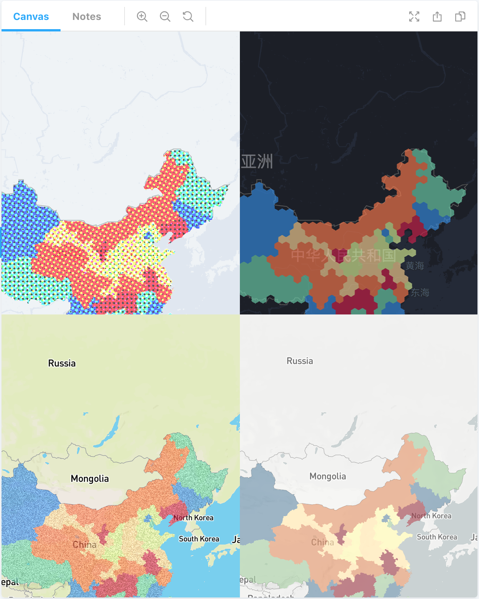
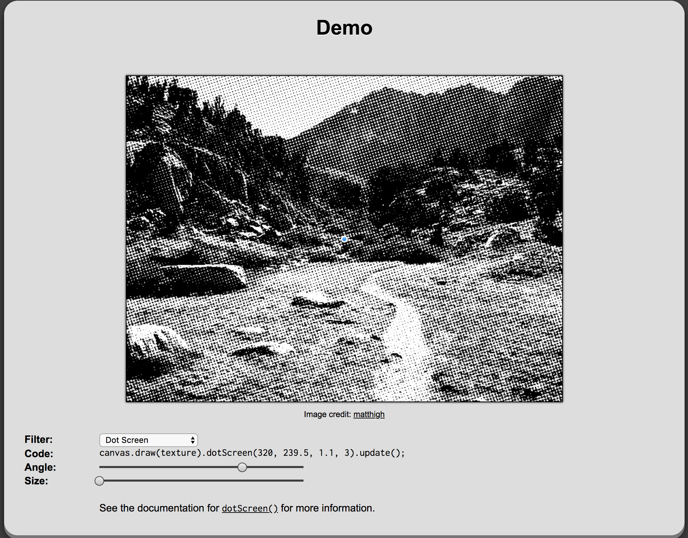
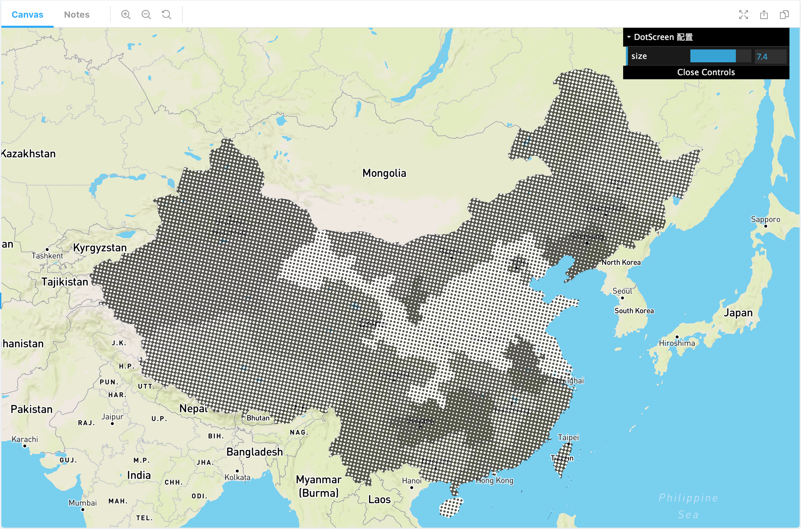

# 自定义后处理效果

L7 自定义了一套较为灵活的渲染管线，在后处理效果方面提供了最大程度的扩展性。除了直接使用内置的常用效果（例如下图中 ColorHalftone、六边形像素化、噪声、Sepia），开发者还可以自定义任何后处理效果，在场景中完成注册即可应用到任意图层上。



下面我们以 [glfx.js](http://evanw.github.io/glfx.js/demo/) 中的 Dot Screen 效果（下图）为例，介绍如何在 PolygonLayer 中应用这种效果。完整 DEMO 代码[在此]()。



我们将分成三步介绍：

1. 定义效果
   - 定义效果参数
   - 继承后处理效果基类
   - 编写 Fragment Shader
2. 在场景中注册效果
3. 在图层中使用效果

## 定义效果

### 定义效果参数

实现任何一种后处理效果，我们都希望提供一些灵活的参数，可以在运行时供使用者修改。以我们需要实现的 Dot Screen 效果为例，参数接口 `IDotScreenEffectConfig` 定义如下：

```typescript
interface IDotScreenEffectConfig {
  center: [number, number]; // pattern 圆心
  angle: number; // dot 旋转角度
  size: number; // dot 尺寸
}
```

### 继承后处理效果基类

为了最大程度减少样板代码，L7 提供了 `BasePostProcessingPass` 基类供子类继承，同时通过泛型将上一步定义的参数接口传入：

```typescript
import { BasePostProcessingPass } from '@antv/l7';

class DotScreenEffect extends BasePostProcessingPass<IDotScreenEffectConfig> {
  //... 省略重载方法
}
```

接下来我们只需要重载基类的一个方法 `setupShaders`。在这个方法中我们可以使用 L7 内置的服务，例如 Shader 服务、渲染服务等，各服务说明及 API 使用方式[详见](./IoC%20容器、依赖注入与服务说明.md)。

```typescript
protected setupShaders() {
  // 使用 Shader 服务注册 GLSL 模块
  this.shaderModuleService.registerModule('dotScreenEffect', {
    vs: this.quad, // Vertex Shader 固定
    fs: ``, // 暂时省略，在下一小节中详细介绍
  });

  // 使用 Shader 服务获取编译后的 GLSL 模块
  const { vs, fs, uniforms } = this.shaderModuleService.getModule('dotScreenEffect');
  // 使用渲染器服务获取视口尺寸
  const { width, height } = this.rendererService.getViewportSize();

  return {
    vs,
    fs,
    uniforms: {
      ...uniforms,
      u_ViewportSize: [width, height],
    },
  };
}
```

### 编写 Fragment Shader

在编写 Fragment Shader 时，可以按照如下模版。由于 L7 实现了简单的 GLSL 模块化，可以使用一些特殊的语法，例如：

- Uniform 设置默认值
- 引入 L7 内置 GLSL 模块

```glsl
varying vec2 v_UV;

uniform sampler2D u_Texture;
uniform vec2 u_ViewportSize : [1.0, 1.0];

// 自定义效果参数声明

// 自定义效果函数 myCustomEffect 定义

void main() {
  // 纹理采样
  gl_FragColor = vec4(texture2D(u_Texture, v_UV));
  // 应用自定义效果函数
  gl_FragColor = myCustomEffect(gl_FragColor, u_ViewportSize, v_UV);
}
```

Dot Screen 效果具体 GLSL 代码可以参考 [luma.gl](https://github.com/uber/luma.gl/blob/master/modules/engine/src/effects/shader-modules/fun-filters/dotscreen.js#L11-L30)。

完整 Fragment Shader 代码如下。需要注意的是这里 Uniform 名需要和效果配置项属性名统一，即 `size` 对应 `u_Size`、`angle` 对应 `u_Angle`。：

```glsl
varying vec2 v_UV;

uniform sampler2D u_Texture;
uniform vec2 u_ViewportSize : [1.0, 1.0];

// 自定义效果参数及默认值声明
uniform vec2 u_Center : [0.5, 0.5];
uniform float u_Angle : 1;
uniform float u_Size : 3;

// 自定义效果实现
// @see https://github.com/uber/luma.gl/blob/master/modules/engine/src/effects/shader-modules/fun-filters/dotscreen.js#L11-L30
float pattern(vec2 texSize, vec2 texCoord) {
  float scale = 3.1415 / u_Size;
  float s = sin(u_Angle), c = cos(u_Angle);
  vec2 tex = texCoord * texSize - u_Center * texSize;
  vec2 point = vec2(
    c * tex.x - s * tex.y,
    s * tex.x + c * tex.y
  ) * scale;
  return (sin(point.x) * sin(point.y)) * 4.0;
}
vec4 dotScreen_filterColor(vec4 color, vec2 texSize, vec2 texCoord) {
  float average = (color.r + color.g + color.b) / 3.0;
  return vec4(vec3(average * 10.0 - 5.0 + pattern(texSize, texCoord)), color.a);
}

void main() {
  gl_FragColor = vec4(texture2D(u_Texture, v_UV));
  gl_FragColor = dotScreen_filterColor(gl_FragColor, u_ViewportSize, v_UV);
}
```

至此我们就完成了效果的定义。

## 在场景中注册

一种效果要想生效，必须先在场景中完成注册。`scene.registerPostProcessingPass()` 接受两个参数分别为上一步定义的效果构造函数以及效果名。
后续我们在图层中使用时就可以通过效果名引用了：

```typescript
// 场景定义
const scene = new Scene({
  id: 'map',
  map: new Mapbox({
    style: 'mapbox://styles/mapbox/streets-v9',
    center: [110.19382669582967, 50.258134],
    pitch: 0,
    zoom: 3,
  }),
});
// 注册自定义后处理效果
scene.registerPostProcessingPass(
  DotScreenEffect, // 效果构造函数
  'dotScreenEffect', // 效果名，便于后续在图层中引用
);
```

## 在图层中使用效果

和 L7 内置的后处理效果使用方法一致，通过效果名引用，同时传入定义参数即可：

```typescript
const layer = new PolygonLayer({
  enablePicking: true,
  enableHighlight: true,
  passes: [
    [
      'dotScreenEffect', // 引用效果名
      {
        size: 8, // 传入参数
        angle: 1,
      },
    ],
  ],
});
```

最终效果如下：


