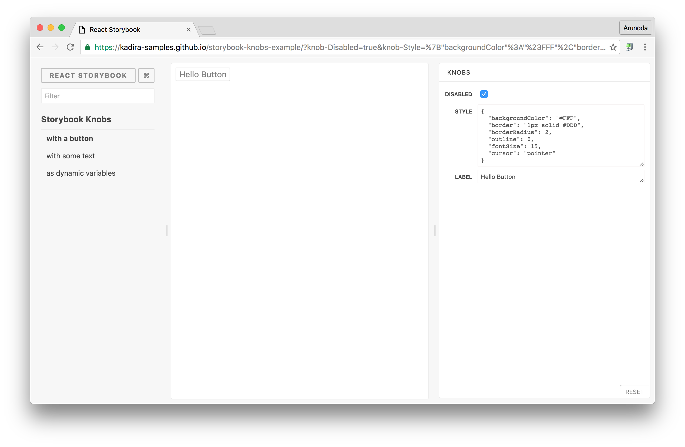
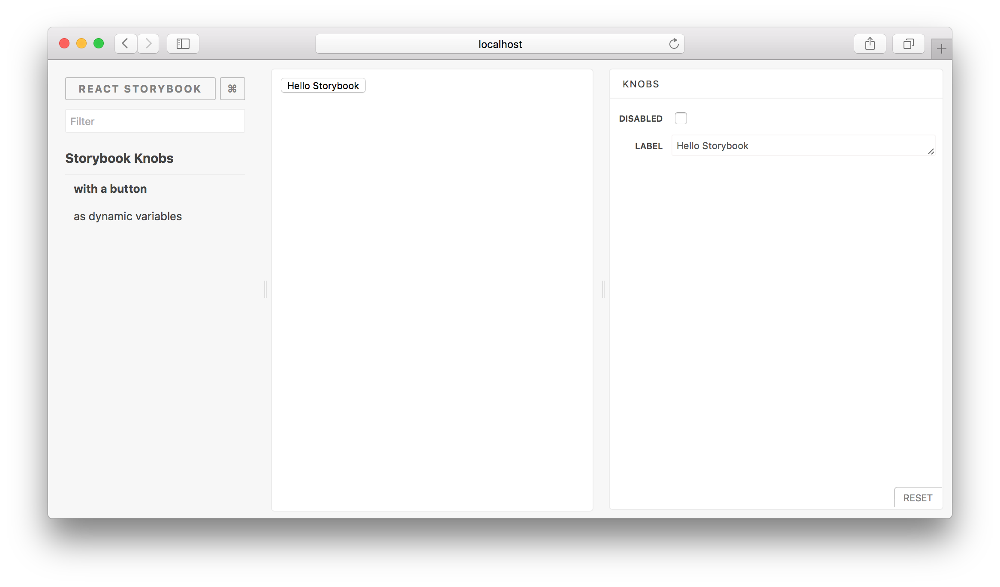

# Storybook Addon Knobs

Storybook Addon Knobs allow you to edit props dynamically using the Storybook UI.
You can also use Knobs as a dynamic variable inside stories in [Storybook](https://storybook.js.org).

[Framework Support](https://github.com/storybookjs/storybook/blob/master/ADDONS_SUPPORT.md).

This is what Knobs looks like:

[](https://storybooks-official.netlify.com/?knob-Dollars=12.5&knob-Name=Storyteller&knob-Years%20in%20NY=9&knob-background=%23ffff00&knob-Age=70&knob-Items%5B0%5D=Laptop&knob-Items%5B1%5D=Book&knob-Items%5B2%5D=Whiskey&knob-Other%20Fruit=lime&knob-Birthday=1484870400000&knob-Nice=true&knob-Styles=%7B%22border%22%3A%223px%20solid%20%23ff00ff%22%2C%22padding%22%3A%2210px%22%7D&knob-Fruit=apple&selectedKind=Addons%7CKnobs.withKnobs&selectedStory=tweaks%20static%20values&full=0&addons=1&stories=1&panelRight=0&addonPanel=storybooks%2Fstorybook-addon-knobs)

> Checkout the above [Live Storybook](https://storybooks-official.netlify.com/?knob-Dollars=12.5&knob-Name=Storyteller&knob-Years%20in%20NY=9&knob-background=%23ffff00&knob-Age=70&knob-Items%5B0%5D=Laptop&knob-Items%5B1%5D=Book&knob-Items%5B2%5D=Whiskey&knob-Other%20Fruit=lime&knob-Birthday=1484870400000&knob-Nice=true&knob-Styles=%7B%22border%22%3A%223px%20solid%20%23ff00ff%22%2C%22padding%22%3A%2210px%22%7D&knob-Fruit=apple&selectedKind=Addons%7CKnobs.withKnobs&selectedStory=tweaks%20static%20values&full=0&addons=1&stories=1&panelRight=0&addonPanel=storybooks%2Fstorybook-addon-knobs) or [watch this video](https://www.youtube.com/watch?v=kopW6vzs9dg&feature=youtu.be).

## Getting Started

First of all, you need to install Knobs into your project as a dev dependency.

```sh
yarn add @storybook/addon-knobs --dev
```

Then, configure it as an addon by adding it to your `addons.js` file (located in the Storybook config directory).

```js
import '@storybook/addon-knobs/register';
```

Now, write your stories with Knobs.

### With React
```js
import React from "react";
import { withKnobs, text, boolean, number } from "@storybook/addon-knobs";

export default {
  title: "Storybook Knobs",
  decorators: [withKnobs]
};
// Add the `withKnobs` decorator to add knobs support to your stories.
// You can also configure `withKnobs` as a global decorator.

// Knobs for React props
export const withAButton = () => (
  <button disabled={boolean("Disabled", false)}>
    {text("Label", "Hello Storybook")}
  </button>
);

// Knobs as dynamic variables.
export const asDynamicVariables = () => {
  const name = text("Name", "Arunoda Susiripala");
  const age = number("Age", 89);

  const content = `I am ${name} and I'm ${age} years old.`;
  return <div>{content}</div>;
};
```

### With Vue.js
MyButton.story.js:
```js
import { storiesOf } from '@storybook/vue';
import { withKnobs, text, boolean } from '@storybook/addon-knobs';

import MyButton from './MyButton.vue';

const stories = storiesOf('Storybook Knobs', module);

// Add the `withKnobs` decorator to add knobs support to your stories.
// You can also configure `withKnobs` as a global decorator.
stories.addDecorator(withKnobs);

// Assign `props` to the story's component, calling
// knob methods within the `default` property of each prop,
// then pass the story's prop data to the component’s prop in
// the template with `v-bind:` or by placing the prop within
// the component’s slot.
stories.add('with a button', () => ({
  components: { MyButton },
  props: {
    isDisabled: {
      default: boolean('Disabled', false)
    },
    text: {
      default: text('Text', 'Hello Storybook')
    }
  },
  template: `<MyButton :isDisabled="isDisabled">{{ text }}</MyButton>`
}));
```

MyButton.vue:
```vue
<template>
  <button :disabled="isDisabled">
    <slot></slot>
  </button>
</template>

<script>
export default {
  props: {
    isDisabled: {
      type: Boolean,
      default: false
    }
  }
}
</script>
```

### With Angular
```js
import { storiesOf } from '@storybook/angular';
import { boolean, number, text, withKnobs } from '@storybook/addon-knobs';

import { Button } from '@storybook/angular/demo';

const stories = storiesOf('Storybook Knobs', module);

// "withKnobs" decorator should be applied before the stories using knobs
stories.addDecorator(withKnobs);

// Knobs for Angular props
stories.add('with a button', () => ({
  component: Button,
  props: {
   text: text('text', 'Hello Storybook'), // The first param of the knob function has to be exactly the same as the component input.
  },
}));

```

Categorize your Knobs by assigning them a `groupId`. When a `groupId` exists, tabs will appear in the Knobs storybook panel to filter between the groups. Knobs without a `groupId` are automatically categorized into the `ALL` group.
```js
// Knob assigned a groupId.
stories.add('as dynamic variables', () => {
  const groupId = 'GROUP-ID1'
  const name = text('Name', 'Arunoda Susiripala', groupId);

  const content = `My name is ${name}.`;
  return (<div>{content}</div>);
});
```

You can see your Knobs in a Storybook panel as shown below.



## Available Knobs

These are the Knobs available for you to use. You can import these Knobs from the `@storybook/addon-knobs` module.
Here's how to import the **text** Knob.

```js
import { text } from '@storybook/addon-knobs';
```

Just like that, you can import any other following Knobs:

### text

Allows you to get some text from the user.

```js
import { text } from '@storybook/addon-knobs';

const label = 'Your Name';
const defaultValue = 'Arunoda Susiripala';
const groupId = 'GROUP-ID1';

const value = text(label, defaultValue, groupId);
```

### boolean

Allows you to get a boolean value from the user.

```js
import { boolean } from '@storybook/addon-knobs';

const label = 'Agree?';
const defaultValue = false;
const groupId = 'GROUP-ID1';

const value = boolean(label, defaultValue, groupId);
```
### number

Allows you to get a number from the user.

```js
import { number } from '@storybook/addon-knobs';

const label = 'Age';
const defaultValue = 78;
const groupId = 'GROUP-ID1';

const value = number(label, defaultValue);
```

For use with `groupId`, pass the default `options` as the third argument.
```
const value = number(label, defaultValue, {}, groupId);
```
### number bound by range

Allows you to get a number from the user using a range slider.

```js
import { number } from '@storybook/addon-knobs';

const label = 'Temperature';
const defaultValue = 73;
const options = {
   range: true,
   min: 60,
   max: 90,
   step: 1,
};
const groupId = 'GROUP-ID1';

const value = number(label, defaultValue, options, groupId);
```

### color

Allows you to get a colour from the user.

```js
import { color } from '@storybook/addon-knobs';

const label = 'Color';
const defaultValue = '#ff00ff';
const groupId = 'GROUP-ID1';

const value = color(label, defaultValue, groupId);
```

### object

Allows you to get a JSON object or array from the user.

```js
import { object } from '@storybook/addon-knobs';

const label = 'Styles';
const defaultValue = {
  backgroundColor: 'red'
};
const groupId = 'GROUP-ID1';

const value = object(label, defaultValue, groupId);
```

> Make sure to enter valid JSON syntax while editing values inside the knob.

### array

Allows you to get an array of strings from the user.

```js
import { array } from '@storybook/addon-knobs';

const label = 'Styles';
const defaultValue = ['Red'];
const groupId = 'GROUP-ID1';

const value = array(label, defaultValue);
```

> While editing values inside the knob, you will need to use a separator.
> By default it is a comma, but this can be overridden by passing a separator variable.
>
> ```js
> import { array } from '@storybook/addon-knobs';
>
> const label = 'Styles';
> const defaultValue = ['Red'];
> const separator = ':';
> const value = array(label, defaultValue, separator);
> ```

For use with `groupId`, pass the default `separator` as the third argument
```
const value = array(label, defaultValue, ',', groupId);
```

### select

It allows you to get a value from a select box from the user.

```js
import { select } from '@storybook/addon-knobs';

const label = 'Colors';
const options = {
  Red: 'red',
  Blue: 'blue',
  Yellow: 'yellow',
  Rainbow: ['red', 'orange', 'etc'],
  None: null,
};
const defaultValue = 'red';
const groupId = 'GROUP-ID1';

const value = select(label, options, defaultValue, groupId);
```

> You can also provide options as an array like this: `['red', 'blue', 'yellow']`.


### radio buttons

It allows you to get a value from a list of radio buttons from the user.

```js
import { radios } from '@storybook/addon-knobs';

const label = 'Fruits';
const options = {
      Kiwi: 'kiwi',
      Guava: 'guava',
      Watermelon: 'watermelon',
};
const defaultValue = 'kiwi';
const groupId = 'GROUP-ID1';

const value = radios(label, options, defaultValue, groupId);
```

### options

Configurable UI for selecting a value from a set of options. 

```js
import { optionsKnob as options } from '@storybook/addon-knobs';

const label = 'Fruits';
const valuesObj = {
  Kiwi: 'kiwi',
  Guava: 'guava',
  Watermelon: 'watermelon',
};
const defaultValue = 'kiwi';
const optionsObj = {
  display: 'inline-radio'
};
const groupId = 'GROUP-ID1';

const value = options(label, valuesObj, defaultValue, optionsObj, groupId);
```
> The display property for `optionsObj` accepts:
> - `radio`
> - `inline-radio`
> - `check`
> - `inline-check`
> - `select`
> - `multi-select`

### files

It allows you to get a value from a file input from the user.

```js
import { files } from '@storybook/addon-knobs';

const label = 'Images';
const accept = '.xlsx, .pdf';
const defaultValue = [];
const groupId = 'GROUP-ID1';

const value = files(label, accept, defaultValue, groupId);
```

> You can optionally specify a [list of file types](https://developer.mozilla.org/en-US/docs/Web/HTML/Element/input/file#accept) which the file input should accept.
> Multiple files can be selected, and will be returned as an array of [Data URLs](https://developer.mozilla.org/en-US/docs/Web/HTTP/Basics_of_HTTP/Data_URIs).

### date

Allows you to get date (and time) from the user.

```js
import { date } from '@storybook/addon-knobs';

const label = 'Event Date';
const defaultValue = new Date('Jan 20 2017');
const groupId = 'GROUP-ID1';

const value = date(label, defaultValue, groupId);
```

> Note: the default value must not change - e.g., do not do `date('Label', new Date())` or `date('Label')`.

The `date` knob returns the selected date as stringified Unix timestamp (e.g. `"1510913096516"`).
If your component needs the date in a different form you can wrap the `date` function:

```js
function myDateKnob(name, defaultValue) {
  const stringTimestamp = date(name, defaultValue)
  return new Date(stringTimestamp)
}
```

### button

It allows you to include a button and associated handler.

```js
import { button } from '@storybook/addon-knobs';

const label = 'Do Something';
const handler = () => doSomething('foobar');
const groupId = 'GROUP-ID1';

button(label, handler, groupId);
```

Button knobs cause the story to re-render after the handler fires.
You can prevent this by having the handler return `false`.

### withKnobs options

withKnobs also accepts two optional options as story parameters.
Usage:

```js
import { storiesOf } from '@storybook/react';
import { withKnobs } from '@storybook/addon-knobs';

const stories = storiesOf('Storybook Knobs', module);

stories.addDecorator(withKnobs)
stories.add('story name', () => ..., {
  knobs: {
    timestamps: true, // Doesn't emit events while user is typing.
    escapeHTML: true // Escapes strings to be safe for inserting as innerHTML. This option is true by default. It's safe to set it to `false` with frameworks like React which do escaping on their side.
                     // You can still set it to false, but it's strongly unrecommendend in cases when you host your storybook on some route of your main site or web app.
  }
});
```

## Typescript

If you are using Typescript, make sure you have the type definitions installed for the following libs:

-   node
-   react

You can install them using:
*assuming you are using Typescript >2.0.*

```sh
yarn add @types/node @types/react --dev
```

