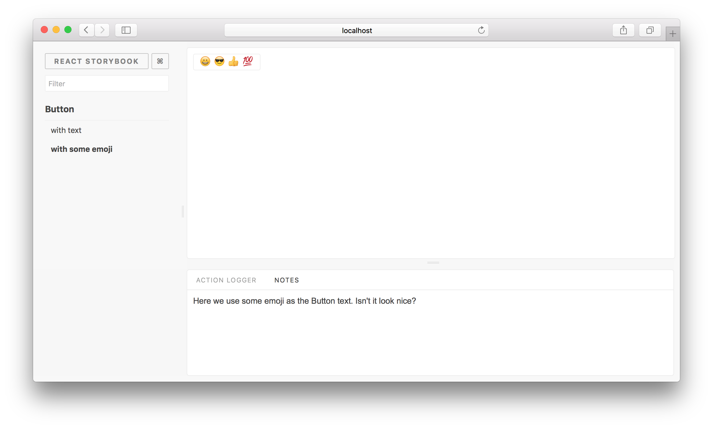

# Storybook Addon Notes

Storybook Addon Notes allows you to write notes (text or HTML) for your stories in [Storybook](https://storybook.js.org).

[Framework Support](https://github.com/storybookjs/storybook/blob/master/ADDONS_SUPPORT.md)



## Getting Started

**NOTE: Documentation on master branch is for alpha version, stable release is on [master](https://github.com/storybookjs/storybook/tree/master/addons/)**

```sh
yarn add -D @storybook/addon-notes
```

Then create a file called `addons.js` in your Storybook config.

Add following content to it:

```js
// register the notes addon as a tab
import '@storybook/addon-notes/register';
// or register the notes addon as a panel. Only one can be used!
import '@storybook/addon-notes/register-panel';
```

Now, you can use the `notes` parameter to add a note to each story.

### With React

```js
import { storiesOf } from '@storybook/react';

import Component from './Component';

storiesOf('Component', module).add('with some emoji', () => <Component />, {
  notes: 'A very simple example of addon notes',
});
```

### With Vue

```js
import { storiesOf } from '@storybook/vue';

import MyButton from './MyButton.vue';

storiesOf('MyButton', module).add(
  'with some emoji',
  () => ({
    components: { MyButton },
    template: '<my-button>😀 😎 👍 💯</my-button>',
  }),
  {
    notes: 'A very simple example of addon notes',
  }
);
```

### With Angular

```js
import { storiesOf } from '@storybook/vue';

import { ButtonComponent } from './button.component';

storiesOf('Button', module).add(
  'with some emoji',
  () => ({
    component: ButtonComponent,
    props: {
      text: '😀 😎 👍 💯'
    }
  }),
  {
    notes: 'A very simple example of addon notes',
  }
);
```

## Using Markdown

Using Markdown in your notes is supported, Storybook will load Markdown as raw by default.

```js
import { storiesOf } from '@storybook/react';
import Component from './Component';
import markdownNotes from './someMarkdownText.md';

storiesOf('Component', module).add('With Markdown', () => <Component />, {
  notes: { markdown: markdownNotes },
});
```

## Giphy

When using Markdown, you can also embed gifs from Giphy into your Markdown. Currently, the value `cheese` of the query prop is used to search and return the first result returned by Giphy.

```md
# Title

<Giphy query='cheese' />
```

## Multiple Notes Sections

If you need to display different notes for different consumers of your storybook (e.g design, developers), you can configure multiple notes pages. The following will render a tab with unique notes for both `Introduction` and `Design`.

```js
import { storiesOf } from '@storybook/react';
import Component from './Component';
import intro from './intro.md';
import design from './design.md';

storiesOf('Component', module).add('With Markdown', () => <Component />, {
  notes: { Introduction: intro, 'Design Notes': design },
});
```
