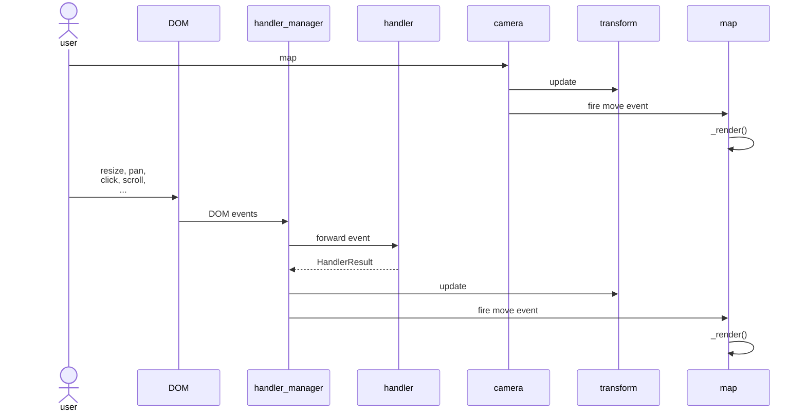

## Map

Map fork from [maplibre-gl-js@4.3.2](https://github.com/maplibre/maplibre-gl-js), keep event loop, responds user interaction and updates the internal state of the map (current viewport, camera angle, etc.)

- [Transform](./src/geo/transform.ts) holds the current viewport details (pitch, zoom, bearing, bounds, etc.). Two places in the code update transform directly:
  - [Camera](./src/camera.ts) (parent class of [Map](./src/map)) in response to explicit calls to [Camera#panTo](./src/camera.ts#L207), [Camera#setCenter](./src/camera.ts#L169)
  - [HandlerManager](./src/handler_manager.ts) in response to DOM events. It forwards those events to interaction processors that live in [src/ui/handler](./src/handler), which accumulate a merged [HandlerResult](./src/handler_manager.ts#L64) that kick off a render frame loop, decreasing the inertia and nudging map.transform by that amount on each frame from [HandlerManager#\_updateMapTransform()](./src/handler_manager.ts#L413). That loop continues in the inertia decreases to 0.
- Both camera and handler_manager are responsible for firing `move`, `zoom`, `movestart`, `moveend`, ... events on the map after they update transform. Each of these events (along with style changes and data load events) triggers a call to [Map#\_render()](./src/map.ts#L2480) which renders a single frame of the map.
