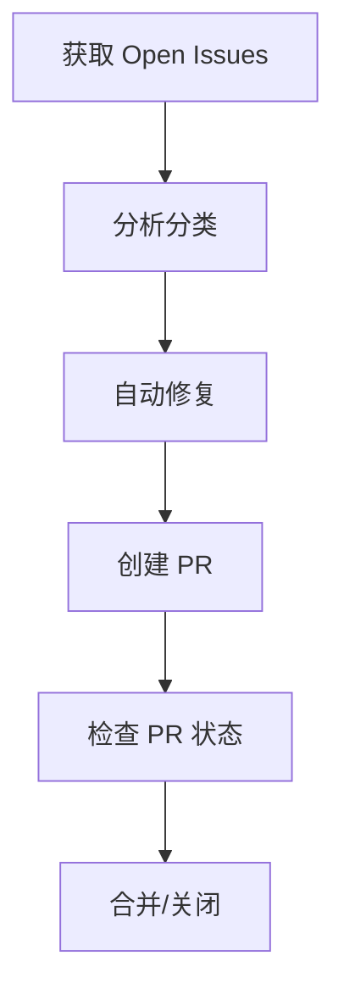

# L7 自动化 Issue 管理工作流

> 本文档描述了从获取 GitHub Issue、分析、修复到创建 PR 的完整自动化流程

## 概述



---

## 1. 获取 GitHub Issues

### 1.1 获取 Open Issues

```bash
# 设置 GitHub Token
export GITHUB_PERSONAL_ACCESS_TOKEN=your_token

# 获取第 1 页（最新 100 个）
curl -s "https://api.github.com/repos/antvis/L7/issues?state=open&per_page=100&sort=created&direction=desc" \
  -H "Authorization: token $GITHUB_PERSONAL_ACCESS_TOKEN" \
  -H "Accept: application/vnd.github.v3+json" > page1.json

# 获取第 2 页
curl -s "https://api.github.com/repos/antvis/L7/issues?state=open&per_page=100&page=2" \
  -H "Authorization: token $GITHUB_PERSONAL_ACCESS_TOKEN" > page2.json

# 获取第 3 页
curl -s "https://api.github.com/repos/antvis/L7/issues?state=open&per_page=100&page=3" \
  -H "Authorization: token $GITHUB_PERSONAL_ACCESS_TOKEN" > page3.json
```

### 1.2 分析 Issue 类型

```python
import json

def analyze_issues(files):
    issues = []
    for f in files:
        with open(f) as file:
            issues.extend(json.load(file))

    categories = {
        "bug": [],
        "feature": [],
        "question": [],
        "help_wanted": [],
        "pr": [],
        "other": []
    }

    for issue in issues:
        labels = [l["name"] for l in issue.get("labels", [])]

        if "bug" in labels:
            categories["bug"].append(issue)
        elif any("pr(" in l for l in labels):
            categories["pr"].append(issue)
        elif "feature" in labels:
            categories["feature"].append(issue)
        elif "question" in labels:
            categories["question"].append(issue)
        elif "help wanted" in labels:
            categories["help_wanted"].append(issue)
        else:
            categories["other"].append(issue)

    return categories
```

### 1.3 生成分析报告

```python
def generate_report(categories, total):
    report = f"""# L7 Open Issues 分析报告

## 统计概览
- **总数**: {total}
- **Bug**: {len(categories['bug'])}
- **Feature Request**: {len(categories['feature'])}
- **Question**: {len(categories['question'])}
- **Help Wanted**: {len(categories['help_wanted'])}
- **PR**: {len(categories['pr'])}
- **Other**: {len(categories['other'])}

## 建议关闭的 Issue
（超过1年无进展的 help wanted/question）
"""
    return report
```

---

## 2. 自动化修复 Issue

### 2.1 识别可修复 Issue

```python
def identify_fixable_issues(issues):
    """
    识别可以自动修复的 Issue 类型：
    1. 简单的 Bug（如参数错误、配置问题）
    2. 文档问题
    3. 格式问题（Prettier/ESLint）
    """
    fixable = []

    for issue in issues:
        title = issue["title"].lower()
        body = (issue.get("body") or "").lower()

        # 格式问题
        if "format" in title or "prettier" in title or "eslint" in title:
            fixable.append({"issue": issue, "type": "format"})

        # 简单的参数错误
        if "typo" in title or "拼写" in title:
            fixable.append({"issue": issue, "type": "typo"})

        # 依赖升级
        if "upgrade" in title or "update" in title and "dependency" in title:
            fixable.append({"issue": issue, "type": "dependency"})

    return fixable
```

### 2.2 自动修复流程

```bash
# 1. 创建修复分支
git checkout -b fix/issue-$(date +%s)

# 2. 应用修复
# - 代码修改
# - 格式化
pnpm prettier --write .
pnpm eslint --fix .

# 3. 提交修复
git add .
git commit -m "fix: 修复 Issue #123

- 修复具体问题描述

Closes #123

Co-Authored-By: Claude <noreply@anthropic.com>"

# 4. 推送分支
git push origin fix/issue-$(date +%s)
```

### 2.3 Python 自动化修复脚本

```python
#!/usr/bin/env python3
import subprocess
import json
import os

class IssueFixer:
    def __init__(self, token, repo="antvis/L7"):
        self.token = token
        self.repo = repo
        self.headers = {
            "Authorization": f"token {token}",
            "Accept": "application/vnd.github.v3+json"
        }

    def fix_formatting_issue(self, issue_number):
        """修复格式化问题"""
        # 运行 Prettier
        subprocess.run(["pnpm", "prettier", "--write", "."], check=True)

        # 运行 ESLint
        subprocess.run(["pnpm", "eslint", "--fix", "."], check=True)

        # 创建提交
        subprocess.run(["git", "add", "."], check=True)
        subprocess.run([
            "git", "commit", "-m",
            f"chore: fix formatting issues (Issue #{issue_number})"
        ], check=True)

        return True

    def fix_typo_issue(self, issue_number, file_path, old_text, new_text):
        """修复拼写错误"""
        # 读取文件
        with open(file_path, 'r') as f:
            content = f.read()

        # 替换文本
        content = content.replace(old_text, new_text)

        # 写回文件
        with open(file_path, 'w') as f:
            f.write(content)

        # 创建提交
        subprocess.run(["git", "add", file_path], check=True)
        subprocess.run([
            "git", "commit", "-m",
            f"docs: fix typo (Issue #{issue_number})"
        ], check=True)

        return True

    def create_pull_request(self, branch_name, issue_number, title):
        """创建 Pull Request"""
        import urllib.request

        data = json.dumps({
            "title": f"fix: {title} (Issue #{issue_number})",
            "head": branch_name,
            "base": "master",
            "body": f"## 描述\n\n修复 Issue #{issue_number}\n\n## 修改内容\n\n- 具体修复内容\n\n## 测试\n\n- [ ] 已通过测试\n\nCloses #{issue_number}"
        }).encode()

        req = urllib.request.Request(
            f"https://api.github.com/repos/{self.repo}/pulls",
            data=data,
            headers=self.headers,
            method="POST"
        )

        response = urllib.request.urlopen(req)
        result = json.loads(response.read().decode())

        return result["number"], result["html_url"]
```

---

## 3. 创建 Pull Request

### 3.1 自动创建 PR

```bash
#!/bin/bash

ISSUE_NUMBER=$1
TITLE=$2
BRANCH_NAME="fix/issue-${ISSUE_NUMBER}-$(date +%s)"

# 创建分支
git checkout -b $BRANCH_NAME

# 应用修复
# ... 修复代码 ...

# 提交
git add .
git commit -m "fix: ${TITLE}

Fixes #${ISSUE_NUMBER}"

# 推送
git push origin $BRANCH_NAME

# 创建 PR
curl -X POST \
  -H "Authorization: token $GITHUB_TOKEN" \
  -H "Accept: application/vnd.github.v3+json" \
  -d "{
    \"title\": \"fix: ${TITLE} (Issue #${ISSUE_NUMBER})\",
    \"head\": \"${BRANCH_NAME}\",
    \"base\": \"master\",
    \"body\": \"## 描述\\n\\n修复 Issue #${ISSUE_NUMBER}\\n\\n## 测试\\n\\n- [ ] 单元测试通过\\n- [ ] 集成测试通过\\n\\nCloses #${ISSUE_NUMBER}\"
  }" \
  https://api.github.com/repos/antvis/L7/pulls
```

### 3.2 PR 模板

```markdown
## 描述

修复 Issue #{issue_number}

## 修改内容

- 具体的修改点 1
- 具体的修改点 2

## 测试

- [ ] 单元测试通过
- [ ] 集成测试通过
- [ ] 手动测试通过

## 截图（如有 UI 修改）

## 检查清单

- [ ] 代码符合项目规范
- [ ] 已添加必要的测试
- [ ] 文档已更新
- [ ] CHANGELOG 已更新

Closes #{issue_number}
```

---

## 4. 检查 PR 状态

### 4.1 获取 PR 列表

```bash
# 获取所有 Open PRs
curl -s "https://api.github.com/repos/antvis/L7/pulls?state=open&per_page=100" \
  -H "Authorization: token $GITHUB_TOKEN" \
  -H "Accept: application/vnd.github.v3+json"
```

### 4.2 检查 PR 状态

```python
import urllib.request
import json
import time

class PRChecker:
    def __init__(self, token, repo="antvis/L7"):
        self.token = token
        self.repo = repo
        self.headers = {
            "Authorization": f"token {token}",
            "Accept": "application/vnd.github.v3+json"
        }

    def get_open_prs(self):
        """获取所有 Open PRs"""
        url = f"https://api.github.com/repos/{self.repo}/pulls?state=open&per_page=100"
        req = urllib.request.Request(url, headers=self.headers)
        response = urllib.request.urlopen(req)
        return json.loads(response.read().decode())

    def check_pr_status(self, pr_number):
        """检查 PR 状态"""
        # 获取 PR 详情
        url = f"https://api.github.com/repos/{self.repo}/pulls/{pr_number}"
        req = urllib.request.Request(url, headers=self.headers)
        response = urllib.request.urlopen(req)
        pr = json.loads(response.read().decode())

        # 获取检查状态
        url = f"https://api.github.com/repos/{self.repo}/pulls/{pr_number}/status"
        req = urllib.request.Request(url, headers=self.headers)
        response = urllib.request.urlopen(req)
        status = json.loads(response.read().decode())

        # 获取审查状态
        url = f"https://api.github.com/repos/{self.repo}/pulls/{pr_number}/reviews"
        req = urllib.request.Request(url, headers=self.headers)
        response = urllib.request.urlopen(req)
        reviews = json.loads(response.read().decode())

        return {
            "pr": pr,
            "status": status,
            "reviews": reviews,
            "mergeable": pr.get("mergeable"),
            "merge_state": pr.get("mergeable_state")
        }

    def generate_pr_report(self):
        """生成 PR 状态报告"""
        prs = self.get_open_prs()

        report = {
            "total": len(prs),
            "ready_to_merge": [],
            "needs_review": [],
            "has_conflicts": [],
            "checks_failing": []
        }

        for pr in prs:
            pr_number = pr["number"]
            status = self.check_pr_status(pr_number)

            if status["mergeable"] and status["merge_state"] == "clean":
                report["ready_to_merge"].append(pr)
            elif status["merge_state"] == "dirty":
                report["has_conflicts"].append(pr)
            elif status["status"].get("state") != "success":
                report["checks_failing"].append(pr)
            else:
                report["needs_review"].append(pr)

        return report
```

### 4.3 PR 状态报告

```python
def print_pr_report(report):
    print(f"""
# PR 状态报告

## 概览
- **总 Open PRs**: {report['total']}
- **可合并**: {len(report['ready_to_merge'])}
- **需要审查**: {len(report['needs_review'])}
- **有冲突**: {len(report['has_conflicts'])}
- **检查失败**: {len(report['checks_failing'])}

## 可合并的 PR
""")

    for pr in report['ready_to_merge']:
        print(f"- #{pr['number']}: {pr['title']} (@{pr['user']['login']})")

    print("\n## 需要审查的 PR")
    for pr in report['needs_review']:
        print(f"- #{pr['number']}: {pr['title']} (@{pr['user']['login']})")

    print("\n## 有冲突的 PR")
    for pr in report['has_conflicts']:
        print(f"- #{pr['number']}: {pr['title']} (@{pr['user']['login']})")
```

---

## 5. 完整自动化脚本

### 5.1 主流程脚本

```bash
#!/bin/bash
# auto_fix_issues.sh

set -e

GITHUB_TOKEN=${GITHUB_TOKEN:-""}
REPO="antvis/L7"
WORK_DIR="/tmp/l7_auto_fix"

echo "🚀 开始自动化 Issue 修复流程"

# 1. 克隆仓库
if [ ! -d "$WORK_DIR" ]; then
    git clone https://github.com/$REPO.git $WORK_DIR
fi
cd $WORK_DIR
git checkout master
git pull origin master

# 2. 获取 Issues
echo "📥 获取 Open Issues..."
python3 << 'PYTHON'
import urllib.request
import json
import os

token = os.environ.get('GITHUB_TOKEN', '')
headers = {
    "Authorization": f"token {token}",
    "Accept": "application/vnd.github.v3+json"
}

issues = []
for page in range(1, 4):
    url = f"https://api.github.com/repos/antvis/L7/issues?state=open&per_page=100&page={page}"
    req = urllib.request.Request(url, headers=headers)
    response = urllib.request.urlopen(req)
    page_issues = json.loads(response.read().decode())
    if not page_issues:
        break
    issues.extend(page_issues)

# 保存 issues
with open('/tmp/all_issues.json', 'w') as f:
    json.dump(issues, f)

print(f"获取到 {len(issues)} 个 issues")
PYTHON

# 3. 分析并识别可修复的 Issues
echo "🔍 分析 Issues..."
python3 << 'PYTHON'
import json

with open('/tmp/all_issues.json') as f:
    issues = json.load(f)

# 识别可修复的 issues
fixable = []
for issue in issues:
    title = issue["title"].lower()
    labels = [l["name"] for l in issue.get("labels", [])]

    # 自动修复规则
    if "format" in title or "prettier" in title:
        fixable.append({"number": issue["number"], "type": "format", "title": issue["title"]})
    elif "typo" in title or "拼写" in title:
        fixable.append({"number": issue["number"], "type": "typo", "title": issue["title"]})

# 保存
with open('/tmp/fixable_issues.json', 'w') as f:
    json.dump(fixable, f)

print(f"发现 {len(fixable)} 个可自动修复的 issues")
PYTHON

# 4. 逐个修复
echo "🔧 开始修复..."
python3 << 'PYTHON'
import json
import subprocess

with open('/tmp/fixable_issues.json') as f:
    issues = json.load(f)

for issue in issues[:5]:  # 限制每次最多修复 5 个
    number = issue["number"]
    issue_type = issue["type"]
    title = issue["title"]

    branch_name = f"auto-fix/issue-{number}"

    # 创建分支
    subprocess.run(["git", "checkout", "-b", branch_name], check=True)

    if issue_type == "format":
        # 运行格式化
        subprocess.run(["pnpm", "prettier", "--write", "."], check=True)
        subprocess.run(["pnpm", "eslint", "--fix", "."], check=True)

        # 提交
        subprocess.run(["git", "add", "."], check=True)
        subprocess.run(["git", "commit", "-m", f"chore: fix formatting (Issue #{number})"], check=True)

    # 推送
    subprocess.run(["git", "push", "origin", branch_name], check=True)

    # 创建 PR
    import urllib.request
    data = json.dumps({
        "title": f"chore: fix formatting (Issue #{number})",
        "head": branch_name,
        "base": "master",
        "body": f"自动修复 Issue #{number}\\n\\nCloses #{number}"
    }).encode()

    headers = {
        "Authorization": f"token {GITHUB_TOKEN}",
        "Accept": "application/vnd.github.v3+json"
    }

    req = urllib.request.Request(
        f"https://api.github.com/repos/antvis/L7/pulls",
        data=data,
        headers=headers,
        method="POST"
    )

    response = urllib.request.urlopen(req)
    result = json.loads(response.read().decode())

    print(f"✅ 修复 Issue #{number}, PR: {result['html_url']}")

    # 切回 master
    subprocess.run(["git", "checkout", "master"], check=True)

PYTHON

echo "✨ 自动化修复完成！"
```

---

## 6. 定时任务配置

### 6.1 GitHub Actions 工作流

```yaml
# .github/workflows/auto-fix.yml
name: Auto Fix Issues

on:
  schedule:
    - cron: '0 2 * * *' # 每天凌晨 2 点
  workflow_dispatch: # 支持手动触发

jobs:
  analyze-and-fix:
    runs-on: ubuntu-latest
    steps:
      - uses: actions/checkout@v3

      - name: Setup Node.js
        uses: actions/setup-node@v3
        with:
          node-version: '18'

      - name: Install dependencies
        run: pnpm install

      - name: Analyze Issues
        env:
          GITHUB_TOKEN: ${{ secrets.GITHUB_TOKEN }}
        run: |
          python3 scripts/analyze_issues.py

      - name: Auto Fix
        env:
          GITHUB_TOKEN: ${{ secrets.GITHUB_TOKEN }}
        run: |
          python3 scripts/auto_fix.py

      - name: Check PR Status
        env:
          GITHUB_TOKEN: ${{ secrets.GITHUB_TOKEN }}
        run: |
          python3 scripts/check_prs.py
```

---

## 7. 监控与告警

### 7.1 发送通知到语雀

```python
import requests

def send_to_yuque(report_content, title="L7 Issue 分析报告"):
    """发送报告到语雀"""

    YUQUE_API = "https://www.yuque.com/api/v2"
    TOKEN = "your_yuque_token"
    NAMESPACE = "your_namespace"
    SLUG = "l7-issue-report"

    headers = {
        "Content-Type": "application/json",
        "X-Auth-Token": TOKEN
    }

    data = {
        "title": title,
        "slug": SLUG,
        "format": "markdown",
        "body": report_content
    }

    response = requests.post(
        f"{YUQUE_API}/repos/{NAMESPACE}/docs",
        headers=headers,
        json=data
    )

    return response.json()
```

### 7.2 发送通知到钉钉/飞书

```python
def send_to_dingtalk(message):
    """发送通知到钉钉"""
    webhook_url = "https://oapi.dingtalk.com/robot/send?access_token=xxx"

    data = {
        "msgtype": "markdown",
        "markdown": {
            "title": "L7 Issue 自动化报告",
            "text": message
        }
    }

    requests.post(webhook_url, json=data)
```

---

## 8. 最佳实践

### 8.1 安全注意事项

1. **Token 管理**
   - 使用 GitHub Actions Secrets 存储 Token
   - 定期轮换 Token
   - 最小权限原则

2. **代码审查**
   - 自动创建的 PR 仍需人工审查
   - 关键修改需要人工确认

3. **测试**
   - 所有自动修复必须通过 CI
   - 单元测试覆盖率检查

### 8.2 限制与边界

```python
# 自动修复的限制
AUTO_FIX_LIMITS = {
    "max_per_run": 5,  # 每次最多修复 5 个
    "types_allowed": ["format", "typo", "docs"],  # 只允许这些类型
    "min_age_days": 7,  # 只修复创建超过 7 天的 issue
    "require_label": ["good first issue", "help wanted"]  # 需要这些标签
}
```

---

## 9. 相关文档

- [GitHub API 文档](https://docs.github.com/en/rest)
- [L7 贡献指南](https://github.com/antvis/L7/blob/master/CONTRIBUTING.md)
- [语雀 API 文档](https://www.yuque.com/yuque/developer/api)

---

## 10. 更新日志

| 日期       | 版本 | 更新内容 |
| ---------- | ---- | -------- |
| 2026-03-18 | v1.0 | 初始版本 |
